Inspired by the IASA Global AI Architecture course, this post explores the critical decision-making process for validating whether an AI implementation is suitable for your project. The course really got me thinking about how often we jump to AI as a solution without rigorously evaluating if it's truly the best fit. This guide aims to share some of those insights.

# Is AI the right solution? A guide to validating AI projects

Before diving into complex AI development, it's crucial to determine if AI is genuinely the most effective and appropriate solution for the problem at hand. This guide outlines key considerations and a decision tree framework to help you make an informed decision.

## The AI project ROI decision tree framework

A decision tree for evaluating AI project ROI, especially for non-technical stakeholders, should be simple, clear, and focus on business outcomes. Here's a potential starting structure:

### Level 1: Strategic alignment

*   **Question 1:** Does the proposed AI project directly align with our company's strategic objectives? (e.g., related to core operations, innovation goals, market positioning, customer satisfaction)
    *   **Yes:** Proceed to evaluate key project pillars.
    *   **No:** Re-evaluate or reject. (Clearly state why it's not aligned).

### Evaluating key project pillars (Objective, Audience, Training, Operations)

To assess the feasibility and potential of an AI project, consider the following four pillars. These should be used alongside broader feasibility criteria (data readiness, skills availability, and technology stack readiness) for a comprehensive evaluation.

1.  **Objective**: Clearly define the problem the AI project aims to solve. Ensure it aligns with the strategic goals of the company and addresses a specific, measurable pain point or opportunity. What does success look like?
2.  **Audience/Impact scope**: Estimate the number of paying customers, internal users, or stakeholders who will benefit from the system. Quantify the potential positive impact (e.g., on customer satisfaction, employee productivity, operational efficiency, revenue generation).
3.  **Training & data**: Evaluate the time, cost, and resources required to acquire/prepare data and train the AI model. Consider the availability, volume, and quality of (labeled) data, and the complexity of the training process. What are the data acquisition and preparation efforts?
4.  **Operational cost & maintenance**: Assess the average daily, monthly, or annual cost of running the AI system in production. Include infrastructure, maintenance, monitoring, model retraining, and ongoing support costs.

### Level 2: Potential business impact

*   **Question 2:** What is the primary expected business benefit?
    *   **A) Cost reduction:** (e.g., optimizing processes, reducing waste, automating manual tasks, lowering operational expenditures) -> Proceed to impact quantification (A)
    *   **B) Revenue increase:** (e.g., personalized experiences, new product/service offerings, market expansion, improved customer acquisition/retention) -> Proceed to impact quantification (B)
    *   **C) Risk mitigation:** (e.g., predicting supply chain disruptions, ensuring quality control, fraud detection, improving compliance) -> Proceed to impact quantification (C)
    *   **D) Efficiency improvement:** (e.g., automating repetitive tasks, speeding up processes, improving resource utilization) -> Proceed to impact quantification (D)
    *   **Other (specify):** (e.g., improved decision making, enhanced innovation capabilities) -> Proceed to impact quantification (Other)

### Level 3: Impact quantification

*   **Question 3 (Example for Cost Reduction):** Can we estimate the potential cost savings with reasonable accuracy?
    *   **Yes:** What are the estimated annual savings? (e.g., <$X, $X-$Y, >$Y). How confident are we in this estimate? -> Proceed to feasibility & effort.
    *   **No:** Further analysis needed before proceeding. Hold. The inability to quantify impact is a significant risk.

*(Similar quantification questions, focusing on measurable outcomes and confidence levels, would follow for revenue increase, risk mitigation, efficiency improvements, etc.)*

### Level 4: Feasibility & effort

This level integrates the "Evaluate key project pillars" with a more direct assessment of implementation challenges.

*   **Question 4:** What is the estimated effort/cost to implement this AI project (including development, infrastructure, training, and initial rollout)?
    *   **Low:** (e.g., <3 months, <$Budget_Low)
    *   **Medium:** (e.g., 3-9 months, $Budget_Low-$Budget_Medium)
    *   **High:** (e.g., >9 months, >$Budget_Medium)
*   **Question 5:** Based on the "Pillars" evaluation, do we have the necessary data (quality, quantity, accessibility), skills (internal team, external support), and technology (infrastructure, tools)?
    *   **Yes, mostly:** Proceed.
    *   **Partially, gaps exist:** Identify gaps and formulate a clear plan to address them. This might involve investment in data acquisition/cleansing, upskilling/hiring, or technology adoption. Factor this into the overall effort and cost.
    *   **No, significant gaps:** High risk. Re-evaluate the project's viability or make foundational investments in prerequisites before proceeding with the AI project itself.

### Level 5: ROI Assessment & Go/No-Go decision

*   **Based on quantified impact vs. estimated effort/cost and risk assessment:**
    *   **High impact / Low effort:** Prioritize (Quick Win). These projects offer the best immediate returns with manageable risk.
    *   **High impact / Medium-High effort:** Strategic bet (plan carefully). These require significant investment and careful planning but promise substantial long-term value. Risk mitigation strategies are crucial.
    *   **Low impact / Low effort:** Consider if resources allow (opportunistic). These can be pursued if they align with strategic goals and don't detract from higher-priority initiatives. Ensure they are genuinely low effort.
    *   **Low impact / High effort:** Avoid or De-prioritize. These projects are unlikely to deliver sufficient value for the investment and effort required.

### Visualizing the decision process: AI project ROI decision tree

```mermaid
graph LR
    A[Start: New AI project proposal] --> B{L1: Strategic alignment?};
    B -- Yes --> FP[Evaluate: Objective, Audience, Training, Operations];
    B -- No --> Z1[Reject/Re-evaluate: not aligned];

    FP --> C{L2: Primary business benefit?};

    C --> D1[Cost reduction];
    C --> D2[Revenue increase];
    C --> D3[Risk mitigation];
    C --> D4[Efficiency improvement];
    C --> D5[Other];

    D1 --> E1{L3: Est. Cost savings accurately?};
    E1 -- Yes --> F1[Est. Annual savings?];
    F1 --> G1[Proceed to feasibility & effort];
    E1 -- No --> Z2[Hold: Further Analysis Needed];

    %% Paths for other benefits leading to feasibility & effort
    D2 -- Quantify benefit --> G1;
    D3 -- Quantify benefit --> G1;
    D4 -- Quantify benefit --> G1;
    D5 -- Quantify benefit --> G1;

    G1 --> H{L4: Estimated effort/cost?};
    H -- Low --> I{L4: Data, Skills, Tech available?};
    H -- Medium --> I;
    H -- High --> I;

    I -- Yes, mostly --> J[Proceed to ROI assessment];
    I -- Partially, gaps exist --> K[Identify/Address gaps then ROI assessment];
    I -- No, significant gaps --> Z3[High risk: Re-evaluate/Invest in prerequisites];

    J --> L{L5: ROI assessment};
    K --> L;

    L -- High impact / Low effort --> M[Prioritize: Quick win];
    L -- High impact / Medium-High effort --> N[Strategic bet: Plan carefully];
    L -- Low impact / Low effort --> O[Opportunistic: Consider if resources allow];
    L -- Low impact / High effort --> P[Avoid/De-prioritize];

    classDef question fill:#f9f,stroke:#333,stroke-width:2px,color:#333,font-size:12px;
    classDef decision fill:#lightgrey,stroke:#333,stroke-width:2px,color:#333,font-size:12px;
    classDef outcomeGreen fill:#ccffcc,stroke:#333,stroke-width:2px,color:#333,font-size:12px;
    classDef outcomeRed fill:#ffcccc,stroke:#333,stroke-width:2px,color:#333,font-size:12px;
    classDef outcomeOrange fill:#ffebcc,stroke:#333,stroke-width:2px,color:#333,font-size:12px;

    class A,B,C,E1,F1,H,I,L,FP question;
    class Z1,Z2,Z3,P outcomeRed;
    class M outcomeGreen;
    class N,O,K outcomeOrange;
    class D1,D2,D3,D4,D5,G1,J decision;
```

*(Note: The "Impact quantification" for benefits other than "Cost reduction" are simplified in this main diagram. For internal detailed planning, you might develop more detailed checklists or sub-diagrams for quantifying each type of benefit.)*

## Applying the Framework: Generic examples

Here’s how this decision tree framework can be applied to common types of AI projects:

### Example 1: AI for Process Optimization (e.g., Manufacturing, Logistics, Back-office)

*   **Strategic alignment:** Does optimizing a specific business process (e.g., reducing production defects, streamlining supply chain logistics, automating data entry) align with strategic goals like cost reduction, improved quality, or operational efficiency?
*   **Pillars evaluation:**
    *   **Objective:** To reduce process cycle time by X%, decrease error rates by Y%, or save Z operational costs.
    *   **Audience/impact:** Affects [Number] internal operators/teams, potentially saving [Number] hours per week or reducing material waste by [Percentage/Quantity].
    *   **Training & data:** Requires historical process data, sensor logs, quality control records, or transaction data. Data collection, cleansing, and labeling might take [Timeframe] and cost [$Amount]. Model training complexity is [Low/Medium/High].
    *   **Operations:** Estimated ongoing operational cost of [$Amount] per month/year for the AI system (cloud resources, monitoring, retraining).
*   **Business impact:** Primarily cost reduction or efficiency improvement. Could also lead to improved quality or compliance.
*   **Impact quantification:** Estimated annual savings of [$Amount] due to reduced labor, fewer errors, less material waste, or faster throughput.
*   **Feasibility & effort:** Assessed as [Low/Medium/High] effort based on data complexity, model requirements, integration with existing systems, and change management needs.
*   **ROI assessment:** If high impact (significant savings/efficiency gains) and manageable effort, it could be a "Quick Win" or "Strategic Bet."

### Example 2: AI for enhanced customer experience (e.g., Personalization, support chatbots)

*   **Strategic alignment:** Does improving customer personalization, support responsiveness, or self-service capabilities align with strategic goals like increasing customer satisfaction, retention, or lifetime value?
*   **Pillars evaluation:**
    *   **Objective:** To increase customer satisfaction scores (CSAT/NPS) by X points, reduce customer churn by Y%, or increase conversion rates by Z%.
    *   **Audience/impact:** Affects [Number/Segment] of customers. Potential to improve engagement for [Percentage]% of the user base.
    *   **Training & data:** Requires customer interaction data (website clicks, purchase history, support transcripts), CRM data, and customer feedback. Data privacy and governance are key. Training might take [Timeframe] and cost [$Amount].
    *   **Operations:** Estimated ongoing operational cost of [$Amount] per month/year.
*   **Business impact:** Primarily revenue increase (through retention, upselling, new customer acquisition) or improved customer satisfaction and loyalty.
*   **Impact quantification:** Estimated annual revenue increase of [$Amount] from improved metrics, or the financial value of reduced churn / increased customer lifetime value.
*   **Feasibility & effort:** Assessed as [Low/Medium/High] effort, considering data integration, model sophistication, UI/UX development, and ethical AI considerations.
*   **ROI assessment:** If high impact (significant revenue uplift or satisfaction boost) and the effort is proportionate, it could be a "Strategic Bet." Ensure ethical implications are thoroughly reviewed.

## Ethical considerations and risks

Beyond the financial and operational aspects, AI projects carry significant ethical responsibilities and potential risks that must be proactively addressed. This section will focus on three key areas:

1.  **Identifying common ethical implications**: This includes understanding issues like bias, fairness, and the need for transparency in AI systems.
2.  **Ensuring equitable and just access and outcomes**: This involves considering how AI impacts different groups and striving for fairness in its application.
3.  **Accounting for environmental impact**: Recognizing that AI systems have non-trivial environmental footprints that need to be considered.

Neglecting these areas can lead to reputational damage, legal issues, and, most importantly, harm to individuals or groups.

### 1. Identifying common ethical implications: bias, fairness, and transparency

AI systems learn from data, and if that data reflects existing societal biases, the AI can perpetuate and even amplify them. This is a critical consideration in any AI project.

*   **Automation and bias:**
    1.  AI systems are designed, built, and trained by humans.
    2.  Humans inherently possess biases and subjective points of view, often unconsciously.
    3.  Automation through AI can accelerate these biases at scale, leading to unfair or discriminatory outcomes, even when developers have the best intentions.

    For example, if an AI model is trained to generate images of historical figures and is predominantly shown images of one demographic for a particular role, it might exclusively produce results reflecting that bias. Consider an AI asked to depict the "Founding Fathers of America." If the training data lacks diversity, the AI might only generate images of white men, inadvertently erasing the contributions and existence of other individuals who were part of that historical context but are underrepresented in common datasets.

    
    *Caption: Example of potential bias in AI-generated imagery if not carefully managed.*

    
    *Caption: Striving for more inclusive and accurate AI outputs requires diverse data and conscious design.*

*   **Privacy considerations:** AI systems often require vast amounts of data for training and validation, raising significant privacy concerns.
    *   **Data de-identification:** Can we truly ensure that all data used is adequately de-identified to protect individuals?
    *   **Production data for retraining:** What are the implications of using inputs and outputs from production environments to further train and iterate on AI models? How is consent managed for this ongoing use?
    *   **Biometrics and facial recognition:** The ease with which AI can process biometrics and perform facial recognition necessitates stringent safeguards and clear policies to prevent misuse.
    *   **Data repurposing:** When data collected for one specific purpose is stored and later reused for AI training or other applications without explicit, informed consent for these new uses, it erodes trust and can violate privacy rights.
    *   **Data longevity:** How long should data be stored, especially sensitive data? What happens when data is stored longer than an individual is alive? Are there clear data disposal policies?
    *   **"Click-through" Consent:** Does a user genuinely provide informed consent for their data to be used in AI training if they simply "click through" a generic "I agree" checkbox, often without fully understanding the implications? The validity and ethics of such consent mechanisms are highly debatable.

*   **Automation and workforce impact:** The drive to automate tasks using AI has profound implications for the workforce.
    *   **Cost of replacement vs. augmentation:** While AI can automate, the cost to develop, fit, and run models that *completely* replace a human worker can be substantial. Often, AI is better suited to augment human capabilities.
    *   **The new essential skills:** It's in every worker's best interest to develop AI-related skills, much like email and word processing skills became standard requirements in the past.
    *   **Upskilling initiatives:** Recognizing this shift, some governments are taking proactive steps. For example, Singapore is investing in paying its citizens to upskill them in AI, aiming for a middle ground between dystopian job displacement and universal basic income.
    *   **Automating repetitive tasks:** AI systems excel at automating repetitive tasks with a high degree of accuracy. This is beneficial for efficiency but directly impacts roles primarily focused on such tasks.
    *   **Worker displacement:** Consequently, this can lead to worker displacement. A notable example is Duolingo, which reportedly laid off 10% of its contractor workforce, citing a greater reliance on AI for content creation and translation. This highlights the real-world impact on employment.

*   **Transparency and explainability:** Understanding how AI systems arrive at their decisions is crucial for trust and accountability.
    *   **Lack of incentive for disclosure:** Many private companies are not inherently incentivized to explain the inner workings of their proprietary algorithms. This "black box" nature can make it difficult to assess fairness, identify biases, or understand why a particular decision was made.
    *   **Outliers in openness:** Some companies are moving towards greater transparency. For instance, X (formerly Twitter) open-sourced its feed algorithm, which utilizes machine learning. Similarly, GitHub has announced plans to open-source parts of VS Code and Copilot's AI components, as detailed in their blog post ([referencing the VS Code blog on open-sourcing AI in the editor](https://code.visualstudio.com/blogs/2025/05/19/openSourceAIEditor)). These initiatives, however, are currently more the exception than the rule. 
    *   **Public distrust:** A lack of transparency can breed significant public distrust. The concerns surrounding TikTok's machine learning algorithm in the US serve as a prominent example.
    *   **Impact of opaque algorithms:** The societal impact of non-transparent algorithms can be severe. For example, there are studies and reports suggesting that algorithms like Instagram's can negatively affect mental health, potentially tripling depression rates in teenage girls, by curating content in ways that are not clear or controllable by the user.
    *   **Regulatory moves (EU AI Act):** Recognizing these challenges, regulations like the EU AI Act are emerging. This act will mandate a degree of transparency for AI systems classified as "high-risk." For such systems, users (and regulators) must be provided with clear instructions on the system's capabilities, limitations, and potential risks.
    *   **Scope of regulation:** It's important to note, however, that most AI applications will likely not fall under the "high-risk" category as defined by the EU AI Act. The majority will be considered "low-risk" or "minimal risk," and thus, the regulatory requirements will be less stringent. However, adhering to ethical guidelines and ensuring transparency will remain best practices regardless of regulatory classification.

    
    *Caption: The EU AI Act aims to regulate high-risk AI systems, emphasizing transparency and user awareness.*
   
## Defining success metrics

Clearly defining what success looks like is paramount before embarking on an AI project. Metrics should be comprehensive, covering not just technical performance but also business impact and ethical considerations.

*   **Business outcomes:**
    *   **Return on investment (ROI):** As discussed in the decision tree, this is fundamental. Quantify expected financial returns, cost savings, or revenue generation.
    *   **Key performance indicators (KPIs):** Align AI project metrics with broader business KPIs. Examples include increased customer satisfaction (NPS, CSAT), improved operational efficiency (cycle time, error rates), market share growth, or enhanced employee productivity.
    *   **Strategic alignment:** How well does the project contribute to achieving long-term strategic goals?

*   **Technical performance:**
    *   **Model accuracy and reliability:** Metrics like precision, recall, F1-score, Mean Absolute Error (MAE), Root Mean Square Error (RMSE), etc., depending on the type of AI model (classification, regression, etc.).
    *   **Scalability and robustness:** Can the system handle increasing loads and adapt to changing data patterns? How resilient is it to unexpected inputs or adversarial attacks?
    *   **Latency and throughput:** How quickly does the system respond, and how much data can it process in a given time?

*   **Ethical and responsible AI metrics:**
    *   **Fairness and bias:** Metrics to detect and mitigate bias across different demographic groups (e.g., demographic parity, equalized odds).
    *   **Transparency and explainability:** Can the system's decisions be understood and audited? Are there mechanisms for users to understand why a certain output was generated?
    *   **Privacy compliance:** Adherence to data privacy regulations (e.g., GDPR, CCPA) and internal data governance policies.
    *   **User trust and acceptance:** Qualitative and quantitative measures of how users perceive and interact with the AI system.

## Pilot project and iteration: Test, learn, adapt

Instead of a large-scale, high-risk deployment, starting with a pilot project is a prudent approach. This allows for testing assumptions, gathering real-world data, and iterating on the solution in a controlled environment.

*   **Start small and focused:**
    *   Choose a well-defined, manageable scope for the pilot.
    *   Focus on a specific use case or a subset of the larger problem.

*   **Define clear pilot objectives:**
    *   What specific questions does the pilot aim to answer?
    *   What are the key success criteria for the pilot phase? (These might be a subset of the overall project success metrics).

*   **Gather data and feedback:**
    *   Collect performance data rigorously.
    *   Actively solicit feedback from users involved in the pilot.
    *   Monitor both quantitative metrics and qualitative insights.

*   **Iterate and refine:**
    *   Use the learnings from the pilot to refine the AI model, the user interface, the workflow, and the overall approach.
    *   Be prepared to pivot or make significant changes based on pilot results. This is the core of agile development.

   
    
    *Caption: The iterative cycle of a pilot project allows for continuous improvement and risk mitigation.*

*   **Assess feasibility and scalability:**
    *   Can the solution, as tested in the pilot, be scaled effectively to meet the full project requirements?
    *   What are the technical, operational, and financial implications of scaling up?

*   **Validate business value:**
    *   Does the pilot demonstrate tangible business value, even on a small scale?
    *   Does it confirm the initial ROI projections or provide data to revise them?

*   **Mitigate risks early:**
    *   The pilot phase is crucial for identifying and addressing potential risks (technical, ethical, operational) before a full-scale rollout.

*   **Make an informed go/no-go decision for full scale:**
    *   Based on the pilot outcomes, make a data-driven decision on whether to proceed with full-scale implementation, make further refinements, or halt the project if it's not viable.

## Conclusion and key takeaways

Validating an AI project is not just a preliminary step; it's an ongoing process crucial for ensuring that technology serves genuine business needs and aligns with ethical principles. The journey from an idea to a successful AI implementation is complex, but a structured approach can significantly increase the chances of success and mitigate potential pitfalls.

**Key takeaways:**

*   **Strategic alignment is non-negotiable:** AI projects must clearly support overarching business goals. If not, they risk becoming costly distractions.
*   **Rigorous evaluation is key:** Use a framework (like the decision tree discussed) to assess ROI, feasibility, and impact across objectives, audience, training, and operations.
*   **Ethical considerations are paramount:** Proactively address bias, privacy, workforce impact, transparency, security, equitable access, and environmental impact from the outset. These are not afterthoughts.
*   **Define success holistically:** Metrics should span business outcomes, technical performance, and responsible AI principles.
*   **Pilot, iterate, and learn:** Start small, test assumptions, gather feedback, and refine your approach before scaling. Be prepared to adapt.
*   **Data is the foundation:** The quality, availability, and ethical sourcing of data are critical success factors for any AI initiative.
*   **Human oversight remains crucial:** AI should augment human capabilities, not replace human accountability. Ensure mechanisms for human review and intervention.

*Caption: Validating AI projects thoroughly leads to more impactful and responsible innovation.*

Determining the viability and potential ROI of AI projects requires a nuanced understanding of both the technology and the specific business context. By following a structured framework like the one outlined above, and by giving due consideration to the ethical implications, organizations can make more informed, strategic decisions about AI investments.

The decision tree framework serves as a valuable tool in this process, providing a clear pathway from initial proposal through to ROI assessment and ethical evaluation. However, it's essential to remember that each AI project is unique, and this framework should be adapted as necessary to fit the specific circumstances and challenges of each project.

In the rapidly evolving landscape of AI technology and its applications, staying informed, flexible, and ethically grounded will be key to successfully harnessing AI's potential while mitigating its risks.

*This guide is based on the IASA Global AI Architecture course and is intended to provide a high-level overview of the considerations and processes involved in validating AI projects. For a more detailed understanding, including technical and operational aspects, further study and consultation with AI and business experts are recommended.*
