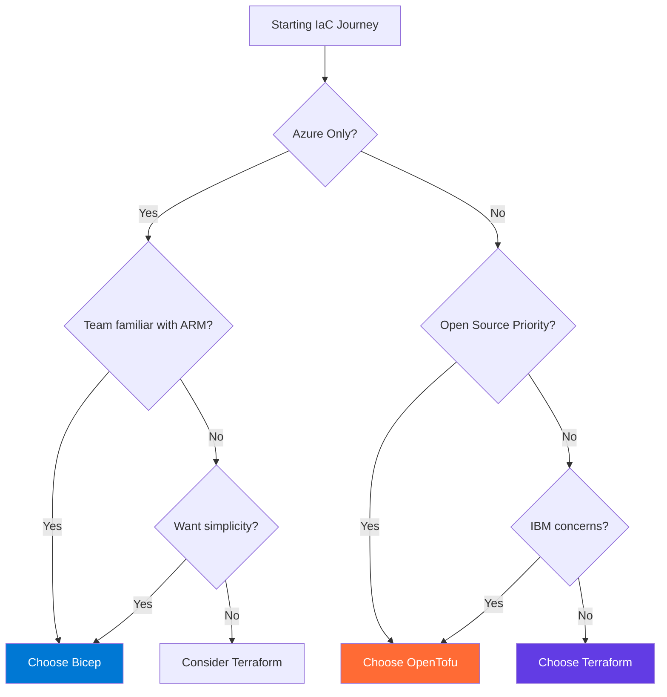

The Infrastructure as Code (IaC) landscape has evolved dramatically over the past few years, with organizations increasingly adopting declarative approaches to manage their cloud resources. Two prominent players have emerged as frontrunners in this space: **Azure Bicep** and **HashiCorp Terraform**. Recently, **OpenTofu** has joined as a community-driven fork of Terraform, offering the same capabilities under open-source governance. While all these tools aim to solve the same fundamental problem (provisioning and managing infrastructure through code), they take different approaches to governance and platform focus.

After working extensively with both Bicep and Terraform across various projects and cloud environments, I've developed strong opinions about when to use each. This isn't just another feature comparison; it's a practical guide based on real-world experience, complete with examples, best practices, and honest assessments of each tool's strengths and weaknesses, plus insights on when OpenTofu might be the right choice.

## Quick comparison overview

| Aspect | Bicep | Terraform | OpenTofu |
|--------|-------|-----------|----------|
| **Cloud Support** | Azure only | Multi-cloud | Multi-cloud (same as Terraform) |
| **Learning Curve** | Gentle (for Azure devs) | Moderate | Identical to Terraform |
| **State Management** | Azure-managed | Manual/Remote | Manual/Remote (same as Terraform) |
| **Syntax** | Clean, intuitive | Verbose but consistent | Identical to Terraform |
| **Features** | Azure-focused | Full multi-cloud | Same feature set as Terraform |
| **Community** | Growing | Large | Emerging (Terraform-compatible) |
| **Vendor** | Microsoft | IBM (HashiCorp) | Linux Foundation |
| **License** | MIT | MPL 2.0 | MPL 2.0 |
| **Best For** | Azure-first teams | Multi-cloud environments | Open-source advocates who want Terraform |

## Understanding the fundamental differences

Before diving into technical details, it's important to understand the core philosophical differences between these tools:

**Bicep** represents Microsoft's vision of Azure-native infrastructure management. It's designed specifically for Azure, embracing the platform's unique characteristics and providing deep integration with Azure Resource Manager (ARM). Think of it as the "native son" approach: built by Azure, for Azure.

**Terraform** embodies HashiCorp's multi-cloud philosophy. It's designed to be cloud-agnostic, treating all cloud providers as equals through its provider ecosystem. This is the "universal translator" approach: one language to rule them all.

**OpenTofu** is essentially Terraform with different governance. Since it's a fork of Terraform, it shares identical syntax, features, and capabilities. The key difference is organizational: OpenTofu is managed by the Linux Foundation as a truly open-source project, while Terraform is now owned by IBM. From a technical standpoint, they're virtually identical.

## Syntax and developer experience: First impressions matter

### Bicep: Clarity through simplicity

Bicep's syntax feels refreshingly clean, especially if you're coming from ARM templates. Here's a simple storage account example:

```bicep
param location string = resourceGroup().location
param storageAccountName string = 'mystorageacct${uniqueString(resourceGroup().id)}'

resource storageAccount 'Microsoft.Storage/storageAccounts@2024-01-01' = {
  name: storageAccountName
  location: location
  sku: {
    name: 'Standard_LRS'
  }
  kind: 'StorageV2'
  properties: {
    accessTier: 'Hot'
  }
}

output storageAccountKey string = storageAccount.listKeys().keys[0].value
```

**What I love about Bicep syntax:**
- Resource definitions feel natural and intuitive
- Strong typing with excellent IntelliSense support
- Direct function calls without complex expression syntax
- Automatic dependency management through symbolic references

### Terraform: Consistency across clouds

Terraform's HCL (HashiCorp Configuration Language) syntax is more verbose but consistent across all providers:

```hcl
variable "location" {
  description = "Azure region for resources"
  type        = string
  default     = "West Europe"
}

variable "resource_group_name" {
  description = "Name of the resource group"
  type        = string
}

resource "azurerm_storage_account" "example" {
  name                     = "mystorageacct${random_string.suffix.result}"
  resource_group_name      = var.resource_group_name
  location                 = var.location
  account_tier             = "Standard"
  account_replication_type = "LRS"
  account_kind             = "StorageV2"
  
  access_tier = "Hot"
}

resource "random_string" "suffix" {
  length  = 8
  special = false
  upper   = false
}

output "storage_account_key" {
  value     = azurerm_storage_account.example.primary_access_key
  sensitive = true
}
```

**What I appreciate about Terraform syntax:**
- Consistent patterns across all cloud providers
- Rich variable and output system
- Powerful built-in functions
- Mature ecosystem of modules and best practices

## Cloud coverage: Scope vs. depth

### Bicep: Azure excellence

Bicep shines when you're all-in on Azure. It supports:
- **Every Azure service** from day one of public preview
- **Latest API versions** immediately available
- **Azure-specific features** like managed identities, KeyVault integration
- **Native ARM template compatibility**

This tight integration means you'll never wait for a provider update to use the latest Azure features. When Azure releases a new service, Bicep can use it immediately.

### Terraform: Multi-cloud mastery

Terraform's strength lies in its breadth:
- **3,000+ providers** covering virtually every cloud and service
- **Consistent workflows** across AWS, Azure, GCP, and others
- **Hybrid deployments** managing on-premises and cloud resources together
- **Third-party services** like DataDog, GitHub, Kubernetes resources

If you're working in a multi-cloud environment or need to manage resources beyond pure cloud infrastructure, Terraform's ecosystem is unmatched.

## State management: Different approaches, different trade-offs

### Bicep: Azure-managed state

One of Bicep's most compelling features is **no local state files**. Azure Resource Manager handles all state management:

| ✅ **Advantages** | ❌ **Limitations** |
|-------------------|-------------------|
| No state file corruption or conflicts | Tied to Azure's deployment model |
| Natural team collaboration without state locking | Less flexibility for complex deployment scenarios |
| Automatic cleanup of orphaned resources | Harder to manage resources across multiple Azure tenants |
| Built-in what-if operations for change preview | Limited to Azure Resource Manager capabilities |
- Harder to manage resources across multiple Azure tenants

### Terraform: Explicit state control

Terraform's state file approach provides fine-grained control:

| ✅ **Advantages** | ⚠️ **Challenges** |
|-------------------|-------------------|
| Complete visibility into managed resources | State file management complexity |
| Support for import operations | Potential for state corruption |
| Flexible backend options (S3, Azure Storage, Terraform Cloud) | Team collaboration requires careful state locking |
| Powerful state manipulation commands | Manual cleanup of orphaned resources |

## Real-world performance and reliability

### Deployment speed

> 💡 **Key insight**: Bicep deployments are generally faster for Azure resources, particularly for complex scenarios involving multiple interdependent resources.

**Why Bicep is faster:**
- Direct ARM template compilation
- Azure's native orchestration  
- Optimized dependency resolution

Terraform deployments can be slower, especially when managing large numbers of resources, but the gap has narrowed significantly with recent performance improvements.

### Error handling and debugging

> 🔍 **Pro tip**: Bicep provides superior error messages for Azure-specific issues. When something goes wrong, you get clear, actionable error messages that directly relate to Azure concepts.

Terraform's error messages can be more cryptic, particularly when dealing with provider-specific issues. However, Terraform's plan output is generally more detailed for understanding what changes will be applied.

## Best practices I've learned

### When to choose Bicep

**Choose Bicep when:**
- You're committed to Azure as your primary cloud platform
- Your team is already familiar with ARM templates
- You want the latest Azure features immediately
- You prefer not to manage state files
- You're building Azure-native solutions

**Bicep best practices:**
- Use modules extensively for reusability
- Leverage parameter files for environment-specific configurations
- Take advantage of the what-if operation before deployments
- Use symbolic names for clear resource references
- Implement proper tagging strategies from the start

```bicep
// Example of a well-structured Bicep module
param environmentName string
param location string = resourceGroup().location

var tags = {
  Environment: environmentName
  ManagedBy: 'Bicep'
  CreatedDate: utcNow('yyyy-MM-dd')
}

module networking 'modules/networking.bicep' = {
  name: 'networking-deployment'
  params: {
    environmentName: environmentName
    location: location
    tags: tags
  }
}

module compute 'modules/compute.bicep' = {
  name: 'compute-deployment'
  params: {
    environmentName: environmentName
    location: location
    subnetId: networking.outputs.subnetId
    tags: tags
  }
}
```

### When to choose Terraform

**Choose Terraform when:**
- You're working with multiple cloud providers
- You need to manage hybrid cloud/on-premises resources
- Your team values the large community and module ecosystem
- You require advanced state management capabilities
- You're building complex, multi-tier applications across various services

**Terraform best practices:**
- Use remote state backends with proper locking
- Implement proper workspace strategies for environments
- Leverage data sources for existing infrastructure
- Use modules from the registry but validate them thoroughly
- Implement proper variable validation and descriptions

```hcl
# Example of a well-structured Terraform configuration
terraform {
  required_version = ">= 1.12.2"
  required_providers {
    azurerm = {
      source  = "hashicorp/azurerm"
      version = "~> 4.34.0"
    }
  }
  
  backend "azurerm" {
    resource_group_name  = "terraform-state-rg"
    storage_account_name = "terraformstatestorage"
    container_name       = "tfstate"
    key                  = "prod.terraform.tfstate"
  }
}

variable "environment" {
  description = "The deployment environment"
  type        = string
  validation {
    condition     = contains(["dev", "staging", "prod"], var.environment)
    error_message = "Environment must be dev, staging, or prod."
  }
}

locals {
  common_tags = {
    Environment = var.environment
    ManagedBy   = "Terraform"
    Project     = "MyProject"
  }
}

module "networking" {
  source = "./modules/networking"
  
  environment = var.environment
  tags        = local.common_tags
}

module "compute" {
  source = "./modules/compute"
  
  environment = var.environment
  subnet_id   = module.networking.subnet_id
  tags        = local.common_tags
}
```

## Learning curve considerations

### Bicep: Easier for Azure developers

If you're already working with Azure, **Bicep has a remarkably gentle learning curve**. The syntax is intuitive, the tooling is excellent, and the concepts map directly to Azure resources you already understand.

**Time to productivity:** 1-2 weeks for basic competency, 1-2 months for advanced scenarios.

### Terraform: More complex but worthwhile

Terraform requires more upfront investment to understand concepts like providers, state, workspaces, and the HCL language itself. However, this investment pays dividends if you're working across multiple platforms.

**Time to productivity:** 2-4 weeks for basic competency, 2-3 months for advanced multi-cloud scenarios.

## Cost considerations beyond licensing

Both tools are free to use, but the total cost of ownership differs:

### Bicep TCO
- **Lower learning costs** for Azure-focused teams
- **Faster development cycles** for Azure-specific features
- **No additional tooling costs** (integrated with Azure tooling)
- **Reduced operational overhead** (no state management)

### Terraform TCO
- **Higher initial learning investment**
- **Potential tooling costs** (Terraform Cloud, enterprise features)
- **State management infrastructure** costs
- **Multi-cloud expertise benefits** that can reduce vendor lock-in costs

## Team and organizational factors

### Bicep: Good for Azure-focused teams

Bicep makes sense when:
- Your organization is committed to Azure
- You have existing ARM template expertise
- You want to minimize tooling complexity
- Your team prefers Microsoft-supported solutions

### Terraform: Better for multi-cloud scenarios

Terraform is the better choice when:
- You're building cloud-agnostic solutions
- You need to manage resources across multiple providers
- Your organization values open-source tooling
- You're planning for potential multi-cloud scenarios

## Advanced use cases

### Large-scale deployments

For large-scale Azure deployments, both tools handle complexity well, but differently:

**Bicep excels at:**
- Azure-specific resource relationships
- Native ARM template integration
- Immediate access to new Azure features

**Terraform excels at:**
- Cross-provider resource management
- Complex data transformations
- Advanced provisioning logic

### GitOps and CI/CD integration

Both tools integrate well with modern DevOps practices:

**Bicep CI/CD strengths:**
- Native GitHub Actions integration
- Azure DevOps built-in tasks
- Simple artifact management (no state files)

**Terraform CI/CD strengths:**
- Mature ecosystem of CI/CD integrations
- Terraform Cloud native workflows
- Advanced plan and apply automation

## My recommendation framework

After years of working with both tools, here's my decision framework:

### Choose Bicep if:
1. **You're Azure-first**: 80%+ of your infrastructure is on Azure
2. **You want simplicity**: Prefer fewer moving parts and concepts
3. **You're migrating from ARM**: Natural evolution path
4. **You value immediate feature access**: Need latest Azure features ASAP

### Choose Terraform if:
1. **You're multi-cloud**: Managing resources across multiple providers
2. **You're hybrid**: Mix of cloud and on-premises resources
3. **You value ecosystem**: Want access to community modules and providers
4. **You need flexibility**: Require advanced state management and automation

### Choose OpenTofu if:
1. **Open-source priority**: Community governance is important to you
2. **Vendor independence**: Want to avoid corporate control
3. **Terraform compatibility**: Need existing Terraform code to work
4. **Long-term stability**: Prefer predictable licensing

## Decision flowchart



### A practical hybrid approach

In larger organizations, I've seen successful implementations using **both tools**:
- **Terraform for foundational infrastructure**: Networking, security, shared services
- **Bicep for application-specific resources**: App Services, Functions, databases

This approach leverages each tool's strengths while minimizing their weaknesses.

## Future developments

Both tools are rapidly evolving:

### What's next for Bicep
- Enhanced module ecosystem
- Better multi-subscription deployment support
- Improved testing and validation tools
- Potential expansion beyond Azure (though unlikely)

### What's next for Terraform
- Continued performance improvements
- Enhanced cloud provider integrations
- Better developer experience tools
- Terraform Cloud feature expansion

## The IBM acquisition factor

It's impossible to discuss Terraform's future without addressing the elephant in the room: IBM's acquisition of HashiCorp in 2024. This major change brings both opportunities and concerns that organizations need to consider when making long-term IaC decisions.

### Potential benefits
- **Enterprise integration**: IBM's enterprise focus could lead to better integration with existing enterprise tools and workflows
- **Increased investment**: More resources for development and support
- **Hybrid cloud expertise**: IBM's hybrid cloud experience could enhance Terraform's multi-cloud capabilities

### Potential concerns
- **Licensing changes**: History shows that acquisitions often lead to licensing model changes that could affect cost
- **Product direction shifts**: IBM's strategic priorities might influence Terraform's roadmap in unexpected ways
- **Community impact**: The open-source community's relationship with the project could change under corporate ownership
- **Vendor lock-in risks**: What was once a vendor-neutral tool is now owned by a cloud provider competitor

### What this means for your decision
If you're choosing between Bicep and Terraform today, the IBM acquisition adds a new variable to consider:

- **For risk-averse organizations**: The uncertainty around Terraform's future under IBM might make Bicep's Microsoft backing more appealing for Azure-focused teams
- **For multi-cloud strategies**: You'll want to monitor how IBM's ownership affects Terraform's neutrality across cloud providers
- **For existing Terraform users**: Consider diversification strategies or at minimum, stay informed about licensing and product direction changes

The acquisition is still relatively recent, and its full implications won't be clear for some time. However, it's a reminder that no tool exists in a vacuum, and vendor relationships matter when making infrastructure decisions.

### The OpenTofu alternative

Speaking of vendor concerns, it's worth mentioning **OpenTofu**, the open-source fork of Terraform that emerged in response to HashiCorp's licensing changes. Maintained by the Linux Foundation, OpenTofu is essentially Terraform with different governance - it shares the same syntax, features, and capabilities.

**Why consider OpenTofu:**
- **Identical to Terraform**: Same syntax, same providers, same state files - it's a drop-in replacement
- **True open source**: No vendor lock-in or licensing restrictions
- **Community governance**: Managed by the Linux Foundation rather than a single company
- **100% Terraform compatibility**: Existing Terraform configurations work without changes
- **Active development**: Growing community and regular releases

**Current considerations:**
- **Smaller ecosystem**: Fewer third-party tools and resources compared to Terraform
- **Provider timing**: Some providers may release updates for Terraform first, then OpenTofu
- **Enterprise tooling**: Terraform Cloud ecosystem is more mature than OpenTofu alternatives

For organizations concerned about vendor control or licensing costs, OpenTofu adds a third path to consider alongside Bicep and Terraform. It's particularly appealing if you value open-source principles and want to avoid potential future licensing surprises.

## What about other IaC tools?

While this post focuses on the declarative configuration language approach (Bicep, Terraform, OpenTofu), it's worth acknowledging that other IaC paradigms exist:

**Pulumi** takes a different approach entirely, using general-purpose programming languages (TypeScript, Python, Go, C#) instead of domain-specific languages. This appeals to developers who prefer familiar programming constructs like loops, conditionals, and functions over declarative configurations.

**AWS CDK, Azure CDK for Terraform, and similar tools** also use programming languages but compile to other IaC formats (CloudFormation, Terraform) rather than running directly.

These imperative approaches have their own trade-offs around testability, debugging, and team collaboration that deserve a dedicated comparison. For this post, I've focused on the declarative DSL ecosystem since that's where most organizations start their IaC journey.

## Final thoughts

Choosing between Bicep, Terraform, and OpenTofu isn't just a technical decision. It's a strategic one that affects your team's productivity, your organization's flexibility, and your long-term infrastructure management approach.

**Bicep represents focused specialization**: deep, native integration with Azure that provides excellent developer experience and immediate access to Azure innovations. If you're building on Azure and plan to stay there, Bicep's focused approach pays dividends in team productivity and reduced complexity.

**Terraform embodies flexible standardization**: one tool, one workflow, across all your infrastructure needs. If you're in a multi-cloud world or value the flexibility to change direction, Terraform's ecosystem and proven track record make it a reliable choice, though the IBM acquisition adds uncertainty.

**OpenTofu offers open-source assurance**: for teams that prioritize community governance and want to avoid vendor dependencies, it provides Terraform compatibility without the corporate overhead.

The reality is that all these tools are excellent at what they do. The choice comes down to understanding your organization's needs, constraints, risk tolerance, and long-term strategy. There's no wrong choice here, only choices that are more or less aligned with your specific context.

What matters most is picking one, learning it well, and building great infrastructure with it. The best IaC tool is the one your team actually uses effectively, not the one with the most features on paper.

## 📋 Key takeaways

| Tool | Best for | Key advantage | Main concern |
|------|----------|---------------|-------------|
| **🔵 Bicep** | Azure-focused teams | Native integration, no state files | Limited to Azure only |
| **🟣 Terraform** | Multi-cloud environments | Mature ecosystem, broad provider support | IBM acquisition uncertainty |
| **🟠 OpenTofu** | Open-source advocates | Community governance, vendor independence | Smaller ecosystem |

> 🎯 **Bottom line**: Choose Bicep for Azure simplicity, Terraform for multi-cloud maturity, or OpenTofu for open-source peace of mind. All are solid choices when used appropriately.

---

*What's been your experience with Bicep and Terraform? I'd love to hear about your real-world usage patterns and any challenges you've encountered. Share your thoughts in the comments below or reach out to me directly.*
