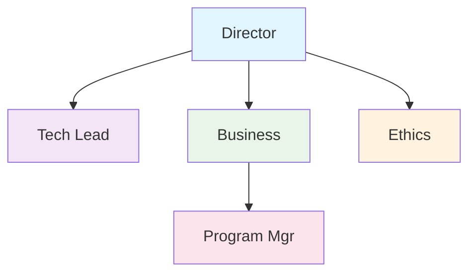
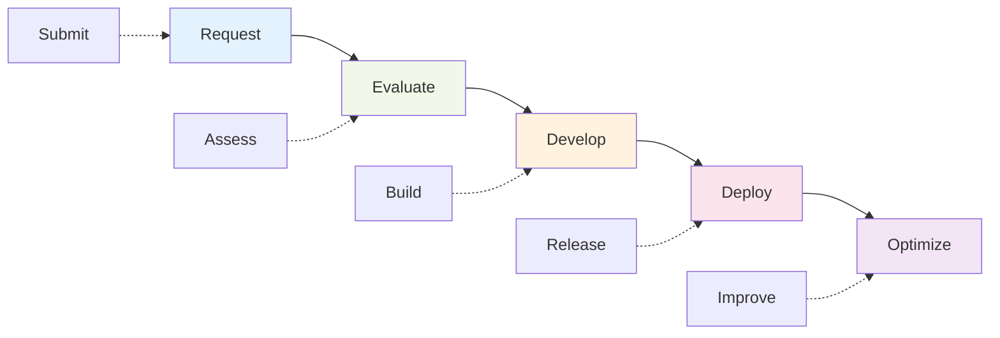
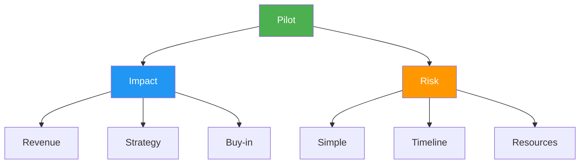
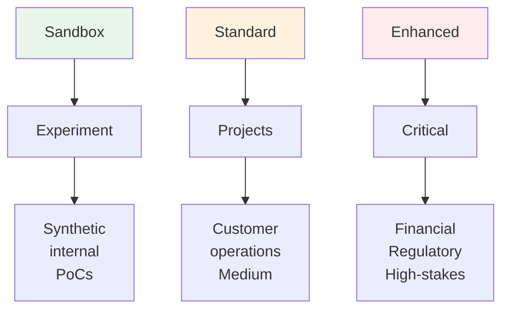
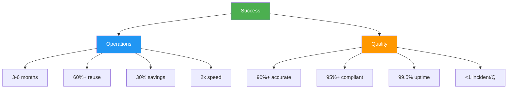
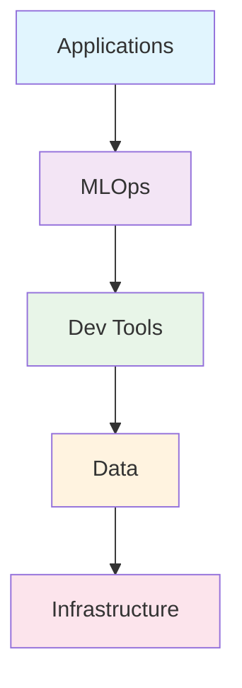
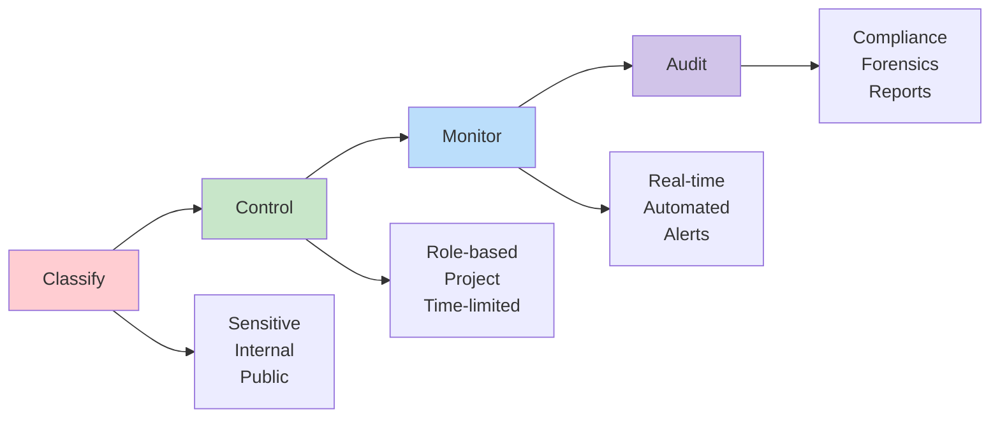
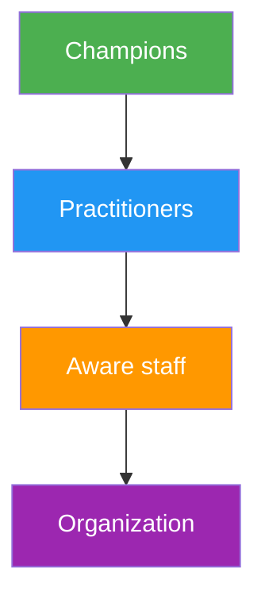
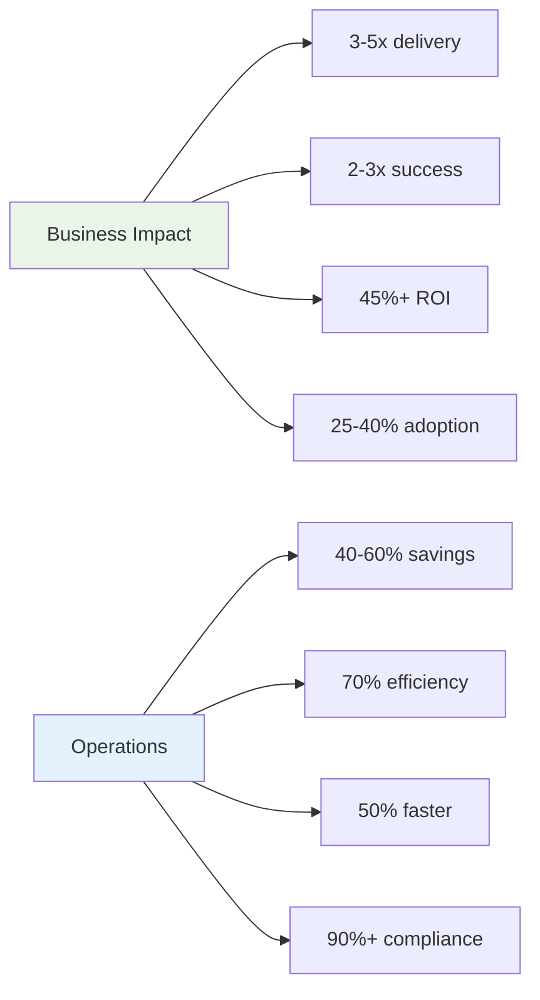

As organizations across industries rush to adopt artificial intelligence, many struggle with fragmented AI initiatives, inconsistent governance, and duplicated efforts across different departments. The answer? A well-structured **Center of Excellence (CCoE) for AI** that provides centralized guidance, governance, and support for enterprise-wide AI adoption.

> **Disclaimer**: The metrics, percentages, and numerical examples used throughout this post are illustrative benchmarks based on industry observations and best practices. They serve as guidance for establishing realistic targets and expectations, but actual results will vary depending on organizational context, industry, and implementation approach.

## What is an AI Center of Excellence?

An AI Center of Excellence is a cross-functional team or organizational unit that serves as the central hub for AI strategy, governance, and enablement within an enterprise. Think of it as the central command for your organization's AI initiatives, providing direction, standards, and support while avoiding the chaos of uncoordinated AI experiments across different departments.

The AI CCoE serves multiple important functions:

| Function | Purpose | Key deliverables |
|----------|---------|------------------|
| **Strategic guidance** | Defining AI vision and roadmaps | AI strategy, business case frameworks, ROI models |
| **Governance & standards** | Establishing ethical guidelines and compliance | Ethics policies, risk frameworks, audit processes |
| **Technical enablement** | Providing platforms and expertise | AI platforms, development tools, architecture standards |
| **Knowledge sharing** | Facilitating collaboration and learning | Proven approaches, communities of practice, success stories |
| **Talent development** | Building organizational AI capabilities | Training programs, certification paths, mentorship |

## Why your organization needs an AI CCoE

The rapid pace of AI innovation creates both tremendous opportunities and significant risks. Without proper coordination, organizations often experience:

### The chaos of uncoordinated AI adoption

> **Warning signs of AI chaos in your organization**

Without proper coordination, organizations often fall into these common traps:

| Problem | Impact | Real-world example |
|---------|--------|-------------------|
| **Duplicated efforts** | Wasted resources, competing systems | Three different departments building customer chatbots independently |
| **Inconsistent quality** | Unreliable outcomes, technical debt | Models with 60% accuracy in production alongside 95% accuracy models |
| **Governance gaps** | Compliance risks, ethical violations | AI hiring tools with undetected gender bias |
| **Resource waste** | Budget overruns, talent misallocation | $2M spent on GPU infrastructure sitting idle |
| **Integration challenges** | Siloed tools, poor user experience | AI tools that can't share data or insights |

### The power of centralized AI excellence

> **The change: From chaos to coordination**

A well-functioning AI CCoE creates measurable improvements across all dimensions:

**Accelerated delivery**  
Shared platforms reduce AI project timelines from 12+ months to 3-6 months through reusable components and standardized processes.

**Consistent quality**  
Standardized testing, validation, and deployment processes ensure 90%+ of AI models meet production readiness criteria.

**Risk mitigation**  
Solid governance frameworks reduce AI-related compliance incidents by 75% through proactive bias testing and ethics reviews.

**Strategic alignment**  
AI initiatives demonstrate clear business value with average ROI increasing from 15% to 45% when aligned with strategic objectives.

**Cultural change**  
Organization-wide AI literacy programs result in 3x higher adoption rates and employee confidence in AI tools.

## Core components of a successful AI CCoE

### 1. Leadership and governance structure

The foundation of any successful AI CCoE starts with clear leadership and decision-making authority. This isn't a committee that meets quarterly to discuss AI trends—it's an operational unit with real responsibility and accountability.

**Key roles and responsibilities:**

| Role | Key responsibilities | Success metrics | Industry reference |
|------|---------------------|-----------------|-------------------|
| **AI CCoE director** | Strategic vision, executive alignment, resource allocation | Business value delivered, stakeholder satisfaction | Oracle: Champion role |
| **Technical lead** | Architecture standards, technical decisions, platform roadmap | System performance, developer productivity | DoD: Digital infrastructure |
| **Business liaison** | Requirements gathering, commercial viability, user adoption | Project ROI, business unit engagement | Deloitte: Business model integration |
| **Ethics officer** | Responsible AI practices, compliance, risk management | Governance adherence, incident reduction | Oracle: Security from Day 1 |
| **Program manager** | Project coordination, resource management, delivery tracking | On-time delivery, budget efficiency | DoD: Barrier removal |

### RACI matrix for AI CCoE governance

> **Clear accountability across organizational levels**

Based on industry experience, here's how responsibilities should be distributed:

| Role | **Accountable** | **Responsible** | **Consulted** | **Informed** |
|------|----------------|-----------------|---------------|-------------|
| **CIO** | AI strategy execution | Platform delivery | Business alignment | Progress reporting |
| **CTO** | Technical architecture | Innovation roadmap | Security policies | Technical decisions |
| **CISO** | AI security compliance | Risk management | Governance framework | Incident response |
| **General Counsel** | Legal compliance | AI ethics policy | Regulatory changes | Risk assessments |
| **Chief Architect** | System integration | Technical standards | Platform decisions | Architecture changes |
| **COO** | Operational impact | Process optimization | Business requirements | Performance metrics |
| **CEO** | Strategic direction | Resource allocation | Major decisions | Executive reporting |

### 2. Operating model and processes

The CCoE needs well-defined processes for how it interacts with the rest of the organization:

> **Three pillars of CCoE operations**

| **Intake & prioritization** | **Development lifecycle** | **Support & maintenance** |
|-------------------------------|------------------------------|------------------------------|
| Clear request processes | Standardized AI project management | Production support models |
| Business value assessment | Experimentation → Production gates | Monitoring & maintenance |
| Technical feasibility scoring | Ethical review checkpoints | Continuous improvement |
| Strategic alignment evaluation | Quality validation processes | Performance optimization |

### The AI project workflow

## Setting up your AI CCoE: A phased approach

> **The 18-month implementation roadmap**

```mermaid
gantt
    title AI CCoE Implementation Roadmap
    dateFormat X
    axisFormat %s
    
    section Phase 1: Foundation
    Build team        :done, phase1a, 0, 1
    Define vision     :done, phase1b, 1, 2
    Set standards     :done, phase1c, 2, 3
    
    section Phase 2: Pilot
    Prove value       :active, phase2a, 3, 6
    Deliver pilots    :phase2b, 4, 8
    Gather feedback   :phase2c, 7, 9
    
    section Phase 3: Scale
    Scale impact      :phase3a, 9, 15
    Organization-wide :phase3b, 12, 18
    Continuous improve:phase3c, 15, 18
```

### Phase 1: Foundation (Months 1-3)

> **Goal**: Establish the foundation and core team

| Week | Focus area | Key deliverables |
|------|------------|------------------|
| **1-4** | **Team assembly** | Core team hired, roles defined, workspace established |
| **5-8** | **Current state** | AI inventory completed, gap analysis, stakeholder map |
| **9-12** | **Vision & governance** | AI strategy document, initial policies, communication plan |

### Phase 2: Pilot programs (Months 4-9)

> **Goal**: Prove value through high-impact demonstrations

| Quarter | Focus | Success criteria |
|---------|-------|------------------|
| **Q2** | **Pilot selection** | 2-3 pilots chosen with clear business value and achievable scope |
| **Q2-Q3** | **Platform development** | Core AI infrastructure operational, development standards implemented |
| **Q3** | **Delivery & learning** | At least 1 pilot successfully deployed, lessons learned documented |

**Pilot selection framework:**

### Phase 3: Scale and expand (Months 10-18)

> **Goal**: Expand across the organization and improve operations

**Scaling strategy:**
- **Horizontal expansion**: Replicate successful patterns across business units
- **Vertical deepening**: Advanced capabilities like MLOps, governance automation
- **Cultural integration**: Organization-wide AI literacy and adoption programs

## Common challenges and how to overcome them

> **The three biggest obstacles to CCoE success**

### Challenge 1: Resistance to centralization

> **The problem**: Business units prefer maintaining control over their AI initiatives

**Why this happens:**
- Fear of losing autonomy and decision-making speed
- Previous negative experiences with centralized IT functions  
- Concerns about reduced innovation and flexibility

**The approach:**

| Instead of... | Do this... | Result |
|---------------|------------|--------|
| Acting as gatekeeper | Position as enabler | Faster delivery with support |
| Mandating compliance | Demonstrate clear value | Voluntary adoption |
| Centralizing ownership | Shared service model | Business units retain control |
| Top-down mandates | Incentive alignment | Natural collaboration |

### Challenge 2: Balancing innovation with governance

> **The tension**: Too much governance kills innovation; too little creates unacceptable risks

**The risk-based governance approach:**

### Challenge 3: Talent acquisition and retention

> **The reality**: AI talent is scarce, expensive, and in high demand

**Multi-pronged talent strategy:**

| **Develop internal** | **Partner external** | **Hybrid models** |
|------------------------|-------------------------|---------------------|
| Training programs      | University partnerships | Consulting augmentation |
| Career development     | Bootcamp collaborations | Contractor specialists |
| Mentorship systems     | Industry exchanges      | Shared service teams |
| Internal mobility      | Open source communities| Center of excellence networks |

## Measuring success: KPIs for your AI CCoE

> **Success requires balanced measurement across four dimensions**

### The AI CCoE scorecard

| **Operational efficiency** | **Quality & governance** | **Business impact** | **Strategic alignment** |
|-------------------------------|----------------------------|------------------------|---------------------------|
| Time to deployment | Model performance accuracy | Project ROI | Initiative-strategy alignment |
| Resource utilization | Governance compliance rate | Business value delivered | Adoption across business units |
| Component reuse rates | Production system uptime | Cost per project delivered | Executive satisfaction scores |
| Developer productivity | Risk incident frequency | Revenue impact | Cultural change metrics |

### Benchmark targets

> **What good looks like in practice (example targets)**

### Monthly CCoE dashboard

| Metric | Current | Target | Trend | Action |
|--------|---------|--------|-------|--------|
| **Projects in pipeline** | 12 | 15 | ↗️ | Increase intake |
| **Avg. deployment time** | 4.2 months | 3.5 months | ↘️ | Process optimization |
| **Model reuse rate** | 45% | 60% | ↗️ | Platform improvement |
| **Business value delivered** | $2.1M | $3M | ↗️ | Focus on high-impact |

## Technology and infrastructure considerations

> **Building the technical foundation for enterprise AI**

### The AI platform stack

### Core platform capabilities

| **Component** | **Purpose** | **Key features** | **Success metrics** |
|---------------|-------------|------------------|-------------------|
| **AI applications** | User-facing AI solutions | Chatbots, recommendations, computer vision | User adoption, business value |
| **MLOps infrastructure** | Production AI operations | CI/CD pipelines, A/B testing, monitoring | Deployment frequency, system uptime |
| **Dev tools** | AI development acceleration | GitHub Copilot, VS Code extensions, AI assistants | Developer velocity, code quality |
| **Data platform** | Unified data access for AI | Secure data lakes, real-time pipelines, governance | Data quality scores, access time |
| **Infrastructure** | Flexible AI workloads | GPU clusters, auto-scaling, cost optimization | Resource utilization, cost per model |

### Security and compliance architecture

> **Zero-trust approach to AI security**

**Data governance framework:**

| **Security layer** | **Implementation** | **Monitoring** |
|-------------------|-------------------|----------------|
| **Data protection** | Encryption, masking, tokenization | Data access patterns, breach detection |
| **Model security** | Adversarial testing, input validation | Model performance drift, attack detection |
| **Privacy controls** | Differential privacy, federated learning | Privacy budget tracking, consent management |
| **Audit capabilities** | Complete logging, lineage tracking | Compliance reports, investigation tools |

## Building AI literacy across the organization

> **Creating an AI-ready workforce through structured learning**

### The AI learning pyramid

### Training programs by audience

| **Audience** | **Program focus** | **Duration** | **Key outcomes** |
|--------------|-------------------|--------------|------------------|
| **Executives** | Strategic AI implications | 2-day intensive | AI strategy, investment decisions, risk understanding |
| **Practitioners** | Hands-on AI development | 3-month program | Model building, deployment, MLOps |
| **General staff** | AI awareness & collaboration | 1-day workshop | AI concepts, ethical considerations, tool usage |
| **Champions** | Advanced specialization | 6-month certification | Leadership, complex problem solving, innovation |

### Learning progression: From awareness to expertise

> **Progressive skill development path**

**Month 1-2: Foundation**
- AI fundamentals and organizational impact
- Ethics and responsible AI principles
- Hands-on experience with no-code AI tools

**Month 3-6: Application**  
- Domain-specific AI use cases
- Collaboration with technical teams
- Basic model evaluation and interpretation

**Month 7-12: Mastery**
- Advanced AI project leadership
- Cross-functional team coordination  
- Innovation and strategic thinking

### Change management at scale

| **Strategy** | **Tactics** | **Success indicators** |
|--------------|-------------|----------------------|
| **Communication** | Regular AI showcases, success stories, newsletters | Awareness scores, engagement metrics |
| **Recognition** | AI innovation awards, career advancement, peer recognition | Participation rates, project quality |
| **Integration** | AI skills in job descriptions, performance reviews | Skill assessment scores, adoption rates |
| **Support** | AI help desk, mentorship programs, communities of practice | Support ticket resolution, satisfaction scores |

## Learning from industry leaders: Real-world AI CCoE insights

> **Lessons from Oracle, Deloitte, and the Department of Defense**

Before diving into next steps, it's valuable to examine how established organizations have structured their AI Centers of Excellence:

### Oracle's 14-point AI CCoE checklist

Oracle's approach emphasizes **speed of execution** and **data excellence** as foundational elements:

| **Data excellence foundation** | **Speed of execution focus** |
|-------------------------------|------------------------------|
| **Common data model** - Consolidate to central repository | **Quick wins** - Build momentum with early successes |
| **Governance** - Keep data consistent across systems | **Strategy integration** - Weave AI into existing business model |
| **Data lake** - Consider adding if not already present | **Security from Day 1** - Bake in compliance and enforcement |
| | **KPI evolution** - Adapt metrics for internal and public reporting |
| | **Upskilling priority** - Keep workforce relevant and engaged |
| | **Cost optimization** - Report organizational savings regularly |

### Deloitte's AI adoption framework

Deloitte's experience highlights critical success factors and common failure modes:

**Success factors:**
- Clear plan for embedding AI within existing business model
- Observable business impact from day one
- Strategic choice between centralized vs. federated models
- Acknowledgment that finding single leadership for multi-disciplinary efforts is challenging

**Common failure modes:**
- No shared vision for AI across the company or within the AI CCoE
- Lack of executive sponsorship and strategic alignment
- Positioning AI CCoE as support role rather than innovator
- Incoherent metrics for measuring AI CCoE performance

### Department of Defense's CDAO model

The DoD's Chief Digital and AI Office (CDAO) provides a template for large-scale, mission-critical AI governance:

**Primary functions:**
- Lead and oversee strategy and policy on data, analytics, and AI
- Break down barriers to adoption across organizational silos
- Create and support digital infrastructure at enterprise scale
- Scale proven use cases while acting as advocate during crises

### Common principles across all models

> **Universal truths for AI CCoE success**

| Principle | Oracle emphasis | Deloitte insight | DoD application |
|-----------|----------------|------------------|-----------------|
| **Measure what matters** | KPI evolution | Observable impact | Strategy & policy leadership |
| **Find a champion** | Executive support | Executive sponsorship | High-level organizational placement |
| **AI as means, not end** | Business integration | Existing model embedding | Mission enablement focus |
| **Build into business model** | Strategy weaving | Clear adoption plan | Infrastructure creation |

## The path forward

> **Building on proven foundations**

Establishing a successful AI Center of Excellence requires patience, persistence, and continuous adaptation. Drawing from industry leaders and successful implementations, the most effective AI CCoEs share several common characteristics:

**Strategic alignment characteristics:**
- **Clear executive sponsorship**: Strong support from senior leadership with authority to make decisions and allocate resources
- **Pragmatic approach**: Focus on delivering value quickly while building long-term capabilities  
- **Business model integration**: AI woven into existing operations rather than bolted on as separate initiative

**Operational excellence characteristics:**
- **Collaborative culture**: Genuine partnership with business units rather than ivory tower isolation
- **Continuous learning**: Willingness to adapt based on experience and changing AI environment
- **Measurable impact**: Observable business outcomes that justify continued investment

The organizations that get this right don't just deploy AI—they change how they operate, make decisions, and create value for their customers.

## Key takeaways

> **The five pillars of AI CCoE success**

Creating a successful AI Center of Excellence requires more than assembling talented data scientists. Success depends on building comprehensive organizational capability:

| **Pillar** | **What it means** | **Why it matters** |
|------------|-------------------|-------------------|
| **Strategic vision** | Clear understanding of how AI supports business objectives | Ensures AI investments deliver measurable business value |
| **Operational excellence** | Well-defined processes for AI development, deployment, governance | Enables scalable, repeatable success across the organization |
| **Technical foundation** | Robust infrastructure and platforms for organization-wide AI | Accelerates development and ensures production reliability |
| **Cultural change** | Building AI literacy and adoption across the entire organization | Creates sustainable competitive advantage through widespread AI capability |
| **Continuous evolution** | Adapting to rapidly changing AI technologies and business needs | Maintains relevance and impact in a fast-moving field |

### The ROI of getting it right

Organizations with mature AI CCoEs typically see:

The investment in building an AI CCoE pays dividends not just in better AI outcomes, but in organizational capability, risk management, and competitive advantage that compounds over time.

---

*What's your experience with AI governance and organizational structures? I'd love to hear about your successes and challenges in scaling AI across enterprise organizations. Share your thoughts in the comments below or reach out to me directly.*
