> **This is Part 1 of a 5-part series on mastering AI-assisted development.** Each week, we'll dive deeper into practical techniques for building production-ready applications with AI coding assistants.

## Series overview

1. **Part 1 (This post)**: The problem and the solution - Why vibe coding fails and what spec-driven development offers
2. **Part 2 (Jan 12)**: Deep dive into the Spec-Kit workflow - Constitution, specs, plans, and tasks
3. **Part 3 (Jan 19)**: Best practices and troubleshooting - Real-world debugging and iteration patterns
4. **Part 4 (Jan 26)**: Team collaboration and advanced patterns - Using Spec-Kit in production environments
5. **Part 5 (Feb 2)**: Case studies and lessons learned - Real projects, real results, real lessons

---

A few weeks ago, I presented at a Xebia .NET synergy event on moving from ad-hoc "vibe coding" to structured, spec-driven development. The questions and discussions afterward showed that developers are wrestling with these same issues, so I decided to expand the content into this blog series.

This blog series is the result of that presentation, expanded and refined based on the feedback and discussions with fellow developers. Whether you attended the event or are discovering this topic for the first time, my goal is to give you practical, actionable guidance for building production-ready AI-assisted applications.

AI coding assistants have changed how we write software. The code they generate often works well enough to ship, but falls apart when you need to maintain or extend it. This guide shows you how to get from code that works to code that's production-ready using specification-driven development.

Based on [GitHub's Spec-Kit](https://github.com/github/spec-kit) and [Addy Osmani's "Beyond Vibe Coding"](https://addyosmani.com/blog/vibe-coding/) guide, this series walks you through a structured approach to AI-assisted development that actually works for real-world applications.

In this first post, we'll explore the fundamental problem with unstructured AI coding and introduce you to the spec-driven approach. Next week, we'll get hands-on with the actual workflow.

---

## The AI shift in software development

Software development has changed significantly in the past few years:

- **Yesterday**: Simple autocomplete finishing variable names and common patterns
- **Today**: AI agents that write entire features, debug complex issues, and refactor codebases
- **Tomorrow**: Autonomous systems handling full development cycles

The question is how to use AI effectively while maintaining code quality.

---

## What is "Vibe Coding"?


The term "vibe coding" comes from Andrej Karpathy (former head of AI at Tesla). It describes an approach where you:

> Accept AI suggestions without critical review, trusting the output completely

For prototypes and experiments? Maybe fine. For production code? We need something more structured.

Key insight: Vibe coding isn't inherently bad code—it's a specific approach where you trust the AI completely and don't review what it produces.

---

## The 70% Problem


Here's the core problem with vibe coding: AI can get you 70% of the way incredibly fast. But that last 30%? That's where things get difficult.

### Four main issues:

1. **Two steps back pattern**: Fixing bugs creates new bugs
2. **Hidden technical debt**: Code works but isn't maintainable
3. **Diminishing returns**: AI helps experts more than beginners
4. **Security vulnerabilities**: Database credentials leak into client-side code

> "We've seen apps leak database credentials because the AI 'helpfully' included them in client-side code."

That's not hypothetical—it happens.

---

## The spectrum of AI-assisted development


AI-assisted development exists on a spectrum:

| Approach | Risk | Reward | Control |
|----------|------|--------|---------|
| **Autocomplete** | Low | Low | High |
| **Chatbot assistance** | Medium | Medium | Medium |
| **Agentic coding** | High | High | Lower |
| **Spec-driven development** | Managed | High | High |

The key insight: As AI gets more capable, we need more structure, not less.

---

## What is AI-assisted engineering?


AI-assisted engineering is not about letting AI do whatever it wants. It's about maintaining human oversight while leveraging AI capabilities.

### Three pillars:

1. **Human-in-the-loop**: You stay in control of decisions
2. **Structured methodology**: Clear processes and checkpoints
3. **Quality guardrails**: Automated checks and balances

Think of it like being the architect while AI is the contractor. You design, they build, but you review everything.

---

## The paradigm shift


This is where the paradigm shift happens:

| OLD WAY | NEW WAY |
|---------|---------|
| Write code first | Write specifications first |
| Document later (maybe) | Code follows from specs |
| Specs are scaffolding | Specs are source of truth |

For decades, we treated specifications as scaffolding—useful during construction but discarded afterward. Now, specifications become the **source of truth** that generates the implementation.

---

## The evolution: three levels of spec-driven development

As Martin Fowler explores in his article on [exploring generative AI](https://martinfowler.com/articles/exploring-gen-ai.html), spec-driven development exists on a maturity spectrum. Understanding these levels helps clarify where Spec-Kit fits.

```mermaid
%%{init: {'theme':'base', 'themeVariables': { 'fontSize':'18px'}}}%%
graph TB
    subgraph Level1["<b>Level 1: Spec-First (Throwaway)</b>"]
        direction TB
        A1["📄 Write spec.md<br/>for feature"] 
        B1["⚙️ Generate<br/>code"]
        C1["🗑️ Delete<br/>spec.md"]
        D1[" "]
        E1["📄 Write new<br/>spec.md"]
        F1["⚙️ Update<br/>code"]
        
        A1 --> B1
        B1 --> C1
        C1 -.->|New feature needed| D1
        D1 -.-> E1
        E1 --> F1
    end
    
    subgraph Level2["<b>Level 2: Spec-Anchored (Multiple Files)</b>"]
        direction TB
        A2["📄 Original<br/>spec.md"] 
        B2["⚙️ Generate<br/>code"]
        D2[" "]
        E2["📝 Write<br/>change-spec.md"]
        F2["⚙️ Update<br/>code"]
        G2["📄 spec.md stays<br/>but outdated"]
        
        A2 --> B2
        B2 -.->|Change needed| D2
        D2 -.-> E2
        E2 --> F2
        F2 --> G2
    end
    
    subgraph Level3["<b>Level 3: Spec-as-Source (Single Truth)</b>"]
        direction TB
        A3["📄 spec.md<br/>is truth"] 
        B3["⚙️ Generate<br/>code"]
        D3[" "]
        E3["✏️ Edit<br/>spec.md"]
        F3["♻️ Regenerate<br/>code"]
        
        A3 --> B3
        B3 -.->|Change needed| D3
        D3 -.-> E3
        E3 --> F3
        F3 -.-> A3
    end
    
    style C1 fill:#ffdddd,stroke:#cc0000,stroke-width:3px
    style E2 fill:#fff4cc,stroke:#cc9900,stroke-width:3px
    style E3 fill:#ddffdd,stroke:#00cc00,stroke-width:3px
    style F3 fill:#ddffdd,stroke:#00cc00,stroke-width:3px
    style A3 fill:#ddffdd,stroke:#00cc00,stroke-width:3px
    
    style Level1 fill:#f9f9f9,stroke:#666,stroke-width:2px
    style Level2 fill:#f9f9f9,stroke:#666,stroke-width:2px
    style Level3 fill:#f9f9f9,stroke:#666,stroke-width:2px
```



### Level 1: Spec-first (throwaway scaffolding)

You write a spec to help the AI understand what to build, then delete it once the code is generated. The spec was just scaffolding—useful temporarily, then discarded.

**Problem**: When you need to change the feature, you start from scratch with a new spec. No continuity, no history.

### Level 2: Spec-anchored (documentation trail)

The original spec persists, but changes are documented in separate files. You're building a paper trail of evolution, but the original spec becomes outdated.

**Problem**: You end up with `spec.md`, `new-feature-spec.md`, `bug-fix-spec.md`, etc. Which one is the source of truth? You have to read them all in order.

### Level 3: Spec-as-source (single source of truth)

The spec is the source of truth. When you need changes, you edit the spec and regenerate the code. The spec stays current because it's the authoritative definition of what the system should do.

**This is where Spec-Kit lives.** The specification isn't documentation of the code—the code is an implementation of the specification.

### Why this matters

In traditional development, we wrote code and maybe documented it later. The code was the truth.

In spec-as-source development, we write specifications and generate code from them. The spec is the truth.

This isn't just a philosophical shift—it's practical. When bugs appear or requirements change, you update the spec and regenerate. The spec never drifts out of sync with reality.

---

## Enter Spec-Kit


[Spec-Kit](https://github.com/github/spec-kit) is GitHub's open-source framework for spec-driven development.

### Key stats:
- **54k+ GitHub stars** — Battle-tested, not experimental
- **18+ AI agents supported** — Claude, Copilot, Cursor, Windsurf, Gemini, and more
- **MIT licensed** — Free to use

### Quick start:
```bash
uv tool install specify-cli --from git+https://github.com/github/spec-kit.git
specify init my-project
```

---

## Core principles


Four core principles guide Spec-Kit:

1. **Intent-driven**: Focus on what and why, not how
2. **Rich specifications**: Detailed context beats vague prompts
3. **Multi-step refinement**: Review and iterate at each phase
4. **AI-native design**: Built specifically for how LLMs think

These aren't arbitrary—they're based on what actually works in practice.

---

## The accountability chain


Here's the complete Spec-Kit workflow:

```
Constitution → Specification → Plan → Tasks → Implementation
```

Each step has a slash command. Each step produces artifacts for the next step. This chain creates **accountability**—you can trace any decision back to its source.

| Step | Command | Output |
|------|---------|--------|
| Constitution | `/speckit.constitution` | `constitution.md` |
| Specify | `/speckit.specify` | `spec.md` |
| Plan | `/speckit.plan` | `plan.md`, `data-model.md`, `api-spec.json` |
| Tasks | `/speckit.tasks` | `tasks.md` |
| Implement | `/speckit.implement` | Working code |

---

## Constitution vs custom instructions


You might be thinking: *"Wait, I already have custom instructions for Copilot or Claude Code. Isn't this the same thing?"*

Great question—and this is the heart of the confusion.

Both files are just Markdown. An LLM can read both the same way. So why does one work better?

### The real difference: workflow integration

**Spec-Kit's constitution** is part of a multi-step enforced workflow:

1. Reads `constitution.md` first
2. Injects it into every step: spec, plan, tasks, implementation
3. Each artifact is validated against the constitution
4. Creates an accountability chain

**Custom instructions** (like Copilot's `copilot-instructions.md`):

1. Added to prompt context
2. Respected during that interaction
3. But no formal spec → plan → tasks chain
4. No artifact accountability

### The analogy

| Spec-Kit | Custom instructions |
|----------|---------------------|
| Architect's blueprint + construction plan + building permits checked at every phase | Style guide for a contractor + final inspection |

Both are valuable! You can even use both together—Copilot's instructions for coding style, Spec-Kit's workflow for complex features.

---

## Step 1: Create your constitution


Think of this as your project's "bill of rights"—the principles that guide all decisions.

### Include things like:

- Code quality standards
- Testing requirements
- Performance targets
- Security guidelines
- Technology constraints

```bash
/speckit.constitution
```

The AI references this during all phases. It's your guardrail against scope creep and over-engineering.

---

## Step 2: Write the specification


Focus on what and why—not how.

### ❌ Don't:
```
Build me a todo app
```

### ✅ Do:
```markdown
## User Stories

As a busy professional, I want to:
- Quickly capture tasks with minimal friction
- See my tasks organized by priority
- Mark tasks complete with a single tap

## Acceptance Criteria
- Task creation takes < 2 seconds
- Tasks persist across browser sessions
- Works offline with sync when online
```

The more context you provide here, the better your results throughout the entire process.

---

## Step 3: Create the technical plan


Now you specify the tech stack. Not before.

Why wait? Because understanding what you're building should drive how you build it.

### The AI generates:

- `plan.md`: Overall architecture
- `data-model.md`: Your data structures
- `api-spec.json`: API contracts
- `research.md`: Framework recommendations

**Pro tip**: Ask the AI to research rapidly-changing frameworks. Its training data might be outdated on specific library versions.

---

## Step 4: Break down into tasks


This takes your plan and breaks it into actionable, implementable chunks.

### Each task includes:

- Clear description
- Dependencies on other tasks
- Acceptance criteria
- Estimated complexity

The key is **ordered execution**—dependencies are respected automatically.

**Review these tasks!** This is your last chance to adjust scope before implementation begins.

---

## Step 5: Implement


The `/speckit.implement` command:

1. Validates all prerequisites exist
2. Parses the task breakdown
3. Executes in correct order
4. Handles errors gracefully

### The execution flow:

```
Load Constitution → Validate Spec → Review Plan → Execute Tasks → Run Tests
```

Critical: Test the application after completion. Feed runtime errors back to the AI.

---

## Handling changes after implementation


What happens when specs change or bugs appear? This is frontier territory, but here's the workflow:

### Before implementation:
- `/speckit.analyze` — Cross-artifact consistency check
- Audit the plan
- `/speckit.checklist` — Verify readiness

### Runtime bugs:
```bash
/implement fix bug: [description with full context]
```

### Spec changes:
1. Update `spec.md`
2. Re-run `/speckit.plan`
3. Re-run `/speckit.tasks`
4. Continue `/implement`

Key principle: "Specification is durable, plan/tasks are flexible"

After any fix, ask AI to: "Update plan, tasks, data-model to reflect this change"

---

## Why this approach works


Four reasons:

1. **Context is king** — AI output quality is proportional to context quality
2. **Audit trail** — Every decision is documented and traceable
3. **Iterative refinement** — Catch mistakes early, not in production
4. **Safety rails** — The constitution prevents over-engineering

Result: You get the full 100%, not just the easy 70%.

---

## Best practice #1: Context is everything


### ❌ Poor context:
```
Why is my code not working?
```

### ✅ Rich context:
```
The handleSubmit function in UserForm.tsx throws 
"Cannot read property 'email' of undefined" on line 47 
when the form is submitted with empty fields.

Stack trace:
[full trace here]

Expected: Form validation should prevent submission
Actual: Error thrown before validation runs
```

The quality of AI output is directly proportional to the context you provide.

---

## Best practice #2: Plan first, code later


This is exactly what happens when you say "build me a todo app" without planning:

You ask for a bicycle. The AI proudly presents... a massive over-engineered robot spaceship.

### The magic words:

> "Give me options, starting with the simplest. Don't code yet."

Ask for architecture OPTIONS first. Start with the simplest viable solution.

---

## Best practice #3: Test ruthlessly


### The rule:

After every AI update:
1. Test in localhost immediately
2. Open browser console
3. Check for errors

### When debugging, be specific:

❌ *"It's broken"*

✅ *"The submit button should save the form data, but instead it shows 'TypeError: Cannot read property map of undefined' in the console"*

Small, incremental testing prevents nightmare debugging sessions.

---

## When to use what


### Vibe coding is fine for:
- Quick prototypes and experiments
- Learning new technologies
- One-off scripts you'll throw away

### Spec-driven is essential for:
- Production applications
- Team projects
- Anything with users
- Code that needs to be maintained

**The key question**: Will someone (including future you) need to understand this code later?

---

## What's next in this series


Now that you understand the *why* behind spec-driven development, you're ready for the *how*.

### Coming next week (Part 2): The Spec-Kit workflow

We'll do a hands-on walkthrough of the complete workflow:

- **Creating your constitution** - What to include and what to skip
- **Writing effective specifications** - Real examples from production projects
- **Generating plans and tasks** - How AI breaks down your spec into implementable chunks
- **The implementation phase** - What happens when you hit `/speckit.implement`
- **Dealing with AI hallucinations** - Practical recovery strategies

Each step will include real code examples, common mistakes, and troubleshooting tips.

### Get ready

Before next week's post, you can:

```bash
# Install Spec-Kit CLI
uv tool install specify-cli --from git+https://github.com/github/spec-kit.git

# Verify installation
specify --version
```

We'll use this in Part 2 to build a real application together.

---

## Key takeaways from part 1


1. **Vibe coding gets you 70%**: The last 30% is where real engineering happens

2. **Specifications are the new source code**: Write them first, code follows

3. **Structure enables speed**: More guardrails means less debugging

4. **Three levels of spec-driven development**: Spec-Kit operates at Level 3 (spec-as-source)

5. **You're the architect**: AI is a tool, but you make the decisions

Next week in Part 2, we'll put these concepts into practice with a complete walkthrough of the Spec-Kit workflow.

---

## Resources

- **Spec-Kit**: [github.com/github/spec-kit](https://github.com/github/spec-kit)
- **Beyond Vibe Coding**: [addyosmani.com/blog/vibe-coding](https://addyosmani.com/blog/vibe-coding/)
- **GitHub Copilot Custom Instructions**: [docs.github.com](https://docs.github.com/en/copilot/how-tos/configure-custom-instructions/add-repository-instructions)

---

## Series navigation

**📍 You are here: Part 1 - The problem and the solution**

- **Next**: Part 2 - Deep dive into the Spec-Kit workflow (Coming January 12, 2026)
- Part 3 - Best practices and troubleshooting (Coming January 19, 2026)
- Part 4 - Team collaboration and advanced patterns (Coming January 26, 2026)
- Part 5 - Case studies and lessons learned (Coming February 2, 2026)

---

*This series is based on a presentation I gave about moving from ad-hoc AI-assisted coding to structured, specification-driven development. The full presentation slides are available for download.*

**Questions or feedback?** Connect with me on [LinkedIn](https://linkedin.com/in/hiddedesmet) or check out more posts at [hiddedesmet.com](https://hiddedesmet.com).

**Want to get notified when Part 2 drops?** Follow me on [LinkedIn](https://linkedin.com/in/hiddedesmet) for updates.
