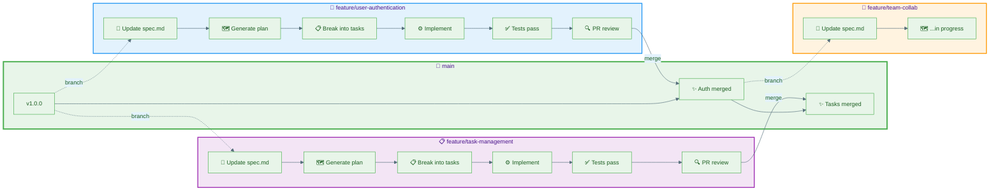

> 🎯 **This is Part 4 of a 5-part series on mastering AI-assisted development.**
>
> We've covered the individual workflow. Now let's scale it to teams and production environments.

## Series overview

| Part | Topic | Status |
|:-----|:------|:------:|
| [Part 1](/from-vibe-coding-to-spec-driven-development) | The problem and the solution | ✓ |
| [Part 2](/from-vibe-coding-to-spec-driven-development-part2) | Deep dive into the Spec-Kit workflow | ✓ |
| [Part 3](/from-vibe-coding-to-spec-driven-development-part3) | Best practices and troubleshooting | ✓ |
| **Part 4** | **Team collaboration and advanced patterns** | 📍 |
| Part 5 | Case studies and lessons learned | Feb 2 |

---

## From solo to team

Everything we've covered so far assumes a single developer working with AI. But real software is built by teams. How does spec-driven development scale?

**The good news**: Spec-Kit was designed with teams in mind. The artifacts (constitution, spec, plan, tasks) become shared contracts that align everyone—humans and AI agents alike.

**The challenge**: Multiple developers, multiple AI sessions, multiple opinions. Without coordination, you get chaos.

This post covers three areas:

1. **Team workflows** - How multiple developers collaborate
2. **CI/CD integration** - Automating validation with GitHub Actions and Azure DevOps
3. **Advanced patterns** - Scaling beyond the monolith

---

## Section 1: Team workflows

### The spec-driven team structure

In a spec-driven team, roles shift slightly:

| Traditional Role | Spec-Driven Role | Primary Artifacts |
|:-----------------|:-----------------|:------------------|
| Tech Lead | **Constitution Guardian** | `constitution.md` |
| Product Owner | **Spec Owner** | `spec.md` |
| Architect | **Plan Reviewer** | `plan.md`, `data-model.md` |
| Developer | **Task Implementer** | `tasks.md`, code |

**Key insight**: The constitution becomes your architecture decision record. The spec becomes your product requirements document. These aren't new artifacts—they're familiar concepts in a format AI can consume.

### Workflow #1: Feature branch per user story

The cleanest approach for teams of 3-8 developers. Each **user story** (US) gets its own feature branch.



**Process:**

1. **Spec Owner** creates feature branch with spec changes
2. **Plan Reviewer** runs `/speckit.plan` and reviews architecture
3. **Task Implementer** runs `/speckit.tasks` and implements
4. **PR review** validates against constitution
5. **Merge** to main with squash commit

*Each user story branch follows the same workflow: spec → plan → tasks → implement → review → merge*

### Workflow #2: Trunk-based with feature flags

For teams practicing continuous deployment (8+ developers).

```
main (always deployable)
 │
 ├── commit: Add user-auth spec (flag: OFF)
 ├── commit: Implement auth backend (flag: OFF)
 ├── commit: Implement auth frontend (flag: OFF)
 ├── commit: Enable user-auth flag (flag: ON)
 │
 └── (features go live via flag toggles)
```

**Process:**

1. All spec changes go to main immediately
2. Implementation happens behind feature flags
3. `/speckit.implement` generates flag-aware code
4. QA tests with flag enabled
5. Flag enabled for all users when ready

**Constitution addition for feature flags:**

```markdown
## Feature Flag Requirements

### Implementation
- All new features MUST be behind feature flags
- Flag naming: `feature_{story_id}_{short_name}`
- Default state: OFF in production

### Flag Service
- Use LaunchDarkly / Azure App Configuration / custom implementation
- Flags evaluated server-side (no client exposure of disabled features)
```

### Workflow #3: Mob programming with AI

Surprisingly effective for complex features.

**Setup:**
- One screen shared (driver)
- 2-4 developers watching (navigators)
- AI assistant running

**Process:**

1. **Navigator 1** dictates spec requirements
2. **Driver** types into AI assistant
3. **Navigator 2** reviews AI output in real-time
4. **All** discuss and refine before accepting
5. **Rotate** driver every 15 minutes

**Why this works**: Multiple humans catch AI hallucinations immediately. Knowledge transfers naturally. Everyone understands the codebase.

---

## Section 2: Code review for spec-driven projects

### The spec-driven PR checklist

Standard code review isn't enough. Add these checks:

```markdown
## PR Review Checklist

### Constitution Compliance
- [ ] Code follows technical constraints
- [ ] Performance targets considered
- [ ] Security requirements addressed
- [ ] No prohibited patterns used

### Spec Alignment
- [ ] Implementation matches user stories
- [ ] All acceptance criteria testable
- [ ] Edge cases from spec handled
- [ ] Error messages match spec exactly

### Plan Consistency
- [ ] Architecture matches plan.md
- [ ] Data model matches data-model.md
- [ ] API contracts match api-spec
- [ ] No undocumented deviations

### AI-Specific Checks
- [ ] No hallucinated dependencies
- [ ] No deprecated patterns
- [ ] Tests actually run (not just generated)
- [ ] No hardcoded localhost/dev values
```

### Review automation

Add a PR template that enforces the checklist:

```markdown
<!-- .github/PULL_REQUEST_TEMPLATE.md -->

## Summary
<!-- What does this PR do? -->

## Related Spec Section
<!-- Link to spec.md section this implements -->

## Constitution Compliance
- [ ] Reviewed against constitution.md
- [ ] No violations or documented exceptions

## Testing
- [ ] Unit tests added/updated
- [ ] Integration tests pass
- [ ] Manual testing completed

## AI Disclosure
- [ ] AI-assisted code reviewed by human
- [ ] All dependencies verified to exist
- [ ] No TODO/FIXME markers from AI
```

---

## Section 3: CI/CD integration

### GitHub Actions pipeline

For teams using GitHub, here's a complete pipeline:

```yaml
# .github/workflows/spec-driven-ci.yml
name: Spec-Driven CI/CD

on:
  push:
    branches: [main]
  pull_request:
    branches: [main]

env:
  DOTNET_VERSION: '9.0.x'

jobs:
  validate-specs:
    name: Validate Specifications
    runs-on: ubuntu-latest
    steps:
      - uses: actions/checkout@v4
      
      - name: Check spec completeness
        run: |
          # Verify required sections exist
          for section in "User Stories" "Acceptance Criteria" "Edge Cases"; do
            if ! grep -q "## $section" .speckit/spec.md; then
              echo "::error::Missing required section: $section"
              exit 1
            fi
          done
          
      - name: Check for TODO markers
        run: |
          if grep -r "TODO\|FIXME\|XXX" .speckit/*.md; then
            echo "::error::Unresolved TODO markers in specifications"
            exit 1
          fi
          
      - name: Validate constitution compliance
        run: |
          # Check nullable reference types (from constitution)
          if ! grep -q "<Nullable>enable</Nullable>" src/*.csproj; then
            echo "::error::Nullable reference types not enabled"
            exit 1
          fi

  build-and-test:
    name: Build and Test
    runs-on: ubuntu-latest
    needs: validate-specs
    steps:
      - uses: actions/checkout@v4
      
      - name: Setup .NET
        uses: actions/setup-dotnet@v4
        with:
          dotnet-version: ${{ env.DOTNET_VERSION }}
          
      - name: Restore dependencies
        run: dotnet restore
        
      - name: Build
        run: dotnet build --no-restore --configuration Release
        
      - name: Run tests
        run: dotnet test --no-build --configuration Release --collect:"XPlat Code Coverage"
        
      - name: Check coverage threshold
        run: |
          # Constitution requires 80% coverage
          coverage=$(cat TestResults/*/coverage.cobertura.xml | grep -oP 'line-rate="\K[^"]+')
          if (( $(echo "$coverage < 0.80" | bc -l) )); then
            echo "::error::Coverage ${coverage} below 80% threshold"
            exit 1
          fi

  security-scan:
    name: Security Scan
    runs-on: ubuntu-latest
    needs: build-and-test
    steps:
      - uses: actions/checkout@v4
      
      - name: Run dependency audit
        run: dotnet list package --vulnerable --include-transitive
        
      - name: OWASP dependency check
        uses: dependency-check/Dependency-Check_Action@main
        with:
          project: 'TeamTaskManager'
          path: '.'
          format: 'HTML'

  deploy-staging:
    name: Deploy to Staging
    runs-on: ubuntu-latest
    needs: [build-and-test, security-scan]
    if: github.ref == 'refs/heads/main'
    environment: staging
    steps:
      - uses: actions/checkout@v4
      
      - name: Deploy to staging
        run: |
          # Your deployment script here
          echo "Deploying to staging..."
```

### Azure DevOps pipeline

Many enterprises in the Netherlands and Europe use Azure DevOps. Here's the equivalent pipeline:

```yaml
# azure-pipelines.yml
trigger:
  branches:
    include:
      - main
  paths:
    exclude:
      - README.md
      - docs/*

pr:
  branches:
    include:
      - main

pool:
  vmImage: 'ubuntu-latest'

variables:
  dotnetVersion: '9.0.x'
  buildConfiguration: 'Release'

stages:
  - stage: Validate
    displayName: 'Validate Specifications'
    jobs:
      - job: ValidateSpecs
        displayName: 'Spec Validation'
        steps:
          - checkout: self
          
          - task: Bash@3
            displayName: 'Check spec completeness'
            inputs:
              targetType: 'inline'
              script: |
                echo "Checking specification completeness..."
                
                required_sections=("User Stories" "Acceptance Criteria" "Edge Cases")
                for section in "${required_sections[@]}"; do
                  if ! grep -q "## $section" .speckit/spec.md; then
                    echo "##vso[task.logissue type=error]Missing required section: $section"
                    exit 1
                  fi
                done
                
                echo "All required sections present"
                
          - task: Bash@3
            displayName: 'Check for unresolved TODOs'
            inputs:
              targetType: 'inline'
              script: |
                if grep -r "TODO\|FIXME" .speckit/*.md; then
                  echo "##vso[task.logissue type=error]Unresolved TODO markers found"
                  exit 1
                fi
                
          - task: Bash@3
            displayName: 'Validate constitution compliance'
            inputs:
              targetType: 'inline'
              script: |
                # Check nullable reference types enabled
                if ! grep -q "<Nullable>enable</Nullable>" src/*.csproj; then
                  echo "##vso[task.logissue type=error]Nullable reference types not enabled (constitution violation)"
                  exit 1
                fi
                
                # Check for raw SQL (prohibited by constitution)
                if grep -r "ExecuteSqlRaw\|FromSqlRaw" src/; then
                  echo "##vso[task.logissue type=error]Raw SQL detected (constitution violation)"
                  exit 1
                fi

  - stage: Build
    displayName: 'Build and Test'
    dependsOn: Validate
    jobs:
      - job: BuildAndTest
        displayName: 'Build & Test'
        steps:
          - checkout: self
          
          - task: UseDotNet@2
            displayName: 'Setup .NET'
            inputs:
              version: $(dotnetVersion)
              
          - task: DotNetCoreCLI@2
            displayName: 'Restore packages'
            inputs:
              command: 'restore'
              projects: '**/*.csproj'
              
          - task: DotNetCoreCLI@2
            displayName: 'Build solution'
            inputs:
              command: 'build'
              projects: '**/*.csproj'
              arguments: '--configuration $(buildConfiguration) --no-restore'
              
          - task: DotNetCoreCLI@2
            displayName: 'Run tests with coverage'
            inputs:
              command: 'test'
              projects: '**/*Tests.csproj'
              arguments: '--configuration $(buildConfiguration) --no-build --collect:"XPlat Code Coverage" --results-directory $(Build.SourcesDirectory)/TestResults'
              
          - task: PublishCodeCoverageResults@2
            displayName: 'Publish coverage report'
            inputs:
              summaryFileLocation: '$(Build.SourcesDirectory)/TestResults/**/coverage.cobertura.xml'
              
          - task: Bash@3
            displayName: 'Enforce coverage threshold'
            inputs:
              targetType: 'inline'
              script: |
                # Constitution requires 80% coverage
                coverage_file=$(find $(Build.SourcesDirectory)/TestResults -name "coverage.cobertura.xml" | head -1)
                if [ -f "$coverage_file" ]; then
                  coverage=$(grep -oP 'line-rate="\K[^"]+' "$coverage_file" | head -1)
                  threshold=0.80
                  if (( $(echo "$coverage < $threshold" | bc -l) )); then
                    echo "##vso[task.logissue type=error]Coverage $coverage is below $threshold threshold"
                    exit 1
                  fi
                  echo "Coverage: $coverage (threshold: $threshold) ✓"
                fi

  - stage: Security
    displayName: 'Security Scanning'
    dependsOn: Build
    jobs:
      - job: SecurityScan
        displayName: 'Dependency & SAST Scan'
        steps:
          - checkout: self
          
          - task: UseDotNet@2
            inputs:
              version: $(dotnetVersion)
              
          - task: DotNetCoreCLI@2
            displayName: 'Check vulnerable packages'
            inputs:
              command: 'custom'
              custom: 'list'
              arguments: 'package --vulnerable --include-transitive'
              
          # If you have Microsoft Defender for DevOps or SonarCloud
          - task: MicrosoftSecurityDevOps@1
            displayName: 'Microsoft Security DevOps'
            continueOnError: true

  - stage: DeployStaging
    displayName: 'Deploy to Staging'
    dependsOn: Security
    condition: and(succeeded(), eq(variables['Build.SourceBranch'], 'refs/heads/main'))
    jobs:
      - deployment: DeployStaging
        displayName: 'Deploy to Staging'
        environment: 'staging'
        strategy:
          runOnce:
            deploy:
              steps:
                - task: AzureWebApp@1
                  displayName: 'Deploy to Azure App Service'
                  inputs:
                    azureSubscription: '$(azureServiceConnection)'
                    appType: 'webApp'
                    appName: '$(stagingAppName)'
                    package: '$(Pipeline.Workspace)/**/*.zip'
```

### Key differences: GitHub Actions vs Azure DevOps

| Aspect | GitHub Actions | Azure DevOps |
|:-------|:---------------|:-------------|
| **Syntax** | YAML with `jobs` | YAML with `stages` and `jobs` |
| **Environments** | `environment:` keyword | Deployment jobs with `environment:` |
| **Secrets** | Repository/org secrets | Variable groups, Key Vault |
| **Logging** | `echo "::error::"` | `##vso[task.logissue]` |
| **Artifacts** | `actions/upload-artifact` | `PublishPipelineArtifact` task |
| **Approvals** | Environment protection rules | Stage gates and approvals |

**Pro tip**: Many Dutch enterprises use Azure DevOps for the tighter Azure integration, built-in boards, and compliance features. GitHub Actions is simpler for open-source or GitHub-native workflows.

---

## Section 4: Advanced architectural patterns

As your application grows, the monolith from Part 2 may need to evolve. Here's how spec-driven development adapts to advanced patterns.

### Pattern #1: Modular monolith

**When to use**: Application growing, but not ready for microservices.

**Constitution update:**

```markdown
## Architecture: Modular Monolith

### Module Boundaries
Each module is a separate project/assembly with:
- Own data access (no cross-module database queries)
- Public API via interfaces only
- Internal implementation hidden

### Modules
- `TeamTaskManager.Users` - Authentication, profiles
- `TeamTaskManager.Teams` - Team management
- `TeamTaskManager.Tasks` - Task CRUD and workflows
- `TeamTaskManager.Notifications` - Email, push notifications

### Communication
- Modules communicate via defined interfaces
- No direct database access across modules
- Events for async communication (MediatR)
```

**Spec pattern:**

```markdown
## Feature: Task Assignment Notification

**Module**: Tasks (primary), Notifications (consumer)

**Given** a task is assigned to a user
**When** the assignment is saved
**Then** Tasks module publishes `TaskAssignedEvent`
**And** Notifications module sends email to assignee
```

### Pattern #2: Backend for Frontend (BFF)

**When to use**: Multiple clients (web, mobile, third-party) need different APIs.

**Constitution update:**

```markdown
## Architecture: Backend for Frontend

### BFF Services
- `TeamTaskManager.WebBFF` - Optimized for Blazor web app
- `TeamTaskManager.MobileBFF` - Optimized for mobile (future)
- `TeamTaskManager.PublicAPI` - Third-party integrations

### Core Services
- BFFs call shared core services
- Core services own business logic
- BFFs handle client-specific concerns (aggregation, formatting)
```

**Plan pattern:**

```markdown
## API Architecture

### Web BFF Endpoints
Optimized for single-page load:
- `GET /web/dashboard` → Returns user, teams, tasks in one call
- `GET /web/team/{id}` → Returns team with members and recent tasks

### Mobile BFF Endpoints (Future)
Optimized for bandwidth:
- `GET /mobile/sync` → Delta sync since last update
- Compressed responses, minimal payload

### Public API
RESTful, versioned, rate-limited:
- `GET /api/v1/tasks` → Standard REST
- OAuth 2.0 authentication
```

### Pattern #3: Event-driven architecture

**When to use**: Need loose coupling, async processing, audit trails.

**Constitution update:**

```markdown
## Architecture: Event-Driven

### Event Bus
- Use Azure Service Bus / RabbitMQ / MassTransit
- All state changes published as events
- Events are immutable facts

### Event Patterns
- **Domain Events**: `TaskCreated`, `TaskCompleted`, `MemberInvited`
- **Integration Events**: Cross-service communication
- **Event Sourcing**: Optional, for audit-critical features

### Guarantees
- At-least-once delivery (consumers must be idempotent)
- Events include correlation ID for tracing
```

**Spec pattern:**

```markdown
## Event: TaskCompleted

**Published when**: User marks task as complete

**Payload:**
```json
{
  "eventId": "uuid",
  "eventType": "TaskCompleted",
  "timestamp": "2026-01-26T10:30:00Z",
  "correlationId": "uuid",
  "data": {
    "taskId": "uuid",
    "completedBy": "userId",
    "teamId": "uuid"
  }
}
```

**Consumers:**
- Notifications: Send completion email to task creator
- Analytics: Update team productivity metrics
- Audit: Log completion event
```

### Pattern #4: Microservices (proceed with caution)

**When to use**: Large team (10+ developers), clear domain boundaries, need independent deployment.

> ⚠️ **Warning**: Don't start with microservices. Extract them from a working monolith when you have clear reasons.

**Constitution update:**

```markdown
## Architecture: Microservices

### Services
- `users-service` - Authentication, profiles (owns users DB)
- `teams-service` - Team management (owns teams DB)
- `tasks-service` - Task management (owns tasks DB)
- `notifications-service` - All notifications (stateless)

### Communication
- Sync: gRPC for internal, REST for external
- Async: Azure Service Bus for events
- No shared databases (each service owns its data)

### Deployment
- Each service independently deployable
- Kubernetes for orchestration
- Service mesh for observability (Istio/Linkerd)

### Data Consistency
- Eventual consistency between services
- Saga pattern for distributed transactions
- Outbox pattern for reliable event publishing
```

### Choosing the right pattern

| Pattern | Team Size | Complexity | When to Choose |
|:--------|:----------|:-----------|:---------------|
| **Monolith** | 1-5 | Low | Starting out, validating product |
| **Modular Monolith** | 3-10 | Medium | Growing, need structure |
| **BFF** | 5-15 | Medium | Multiple client types |
| **Event-Driven** | 5-20 | High | Async workflows, audit needs |
| **Microservices** | 10+ | Very High | Clear domains, independent scaling |

**The spec-driven advantage**: Your constitution documents architectural decisions. When you evolve from monolith to modular to microservices, the spec history shows why.

---

## Section 5: Scaling strategies

### When your application outgrows the initial architecture

The Team Task Manager from Part 2 works great for 100 users. What about 10,000? 100,000?

### Strategy #1: Horizontal scaling

**Constitution update:**

```markdown
## Scaling Requirements

### Stateless Application
- No in-memory session state
- Use distributed cache (Redis) for session
- Any instance can handle any request

### Database Scaling
- Read replicas for query-heavy operations
- Connection pooling required
- Consider read/write splitting at 10k users
```

### Strategy #2: Caching layers

**Spec pattern:**

```markdown
## Performance: Task List Caching

**Given** a user views their team's task list
**When** the list was fetched < 30 seconds ago
**Then** return cached result (skip database)

**Cache invalidation:**
- Task created → Invalidate team's task list cache
- Task updated → Invalidate specific task + team list cache
- Team membership changed → Invalidate all team caches

**Cache implementation:**
- L1: In-memory (IMemoryCache), 10 second TTL
- L2: Distributed (Redis), 30 second TTL
```

### Strategy #3: Background processing

**Constitution update:**

```markdown
## Background Jobs

### Job Queue
- Use Hangfire / Azure Functions / AWS Lambda
- Long-running operations MUST be async

### Job Types
- Email sending (< 1 minute)
- Report generation (< 5 minutes)  
- Data export (< 30 minutes)

### Retry Policy
- 3 retries with exponential backoff
- Dead letter queue for failed jobs
- Alert on repeated failures
```

---

## Section 6: Team communication patterns

### Keeping everyone aligned

Spec-driven development generates artifacts. Those artifacts need to be communicated.

### Pattern #1: Spec review meetings

**Weekly, 30 minutes:**

1. **Spec changes this week** (5 min)
   - What was added/modified/removed?
   
2. **Plan deviations** (10 min)
   - Any architectural decisions that deviated from plan?
   - Update plan.md to reflect reality
   
3. **Constitution amendments** (10 min)
   - Any new constraints discovered?
   - Any constraints that need relaxing?
   
4. **Next week's focus** (5 min)
   - Which user stories are in flight?

### Pattern #2: Async spec updates

For distributed teams:

```markdown
<!-- In PR description -->

## Spec Changes

### Added
- User story: Password-less authentication (magic links)
- Edge case: Handle expired magic links gracefully

### Modified  
- Authentication flow now supports both password and magic link

### Constitution Impact
- None (existing security requirements cover magic links)

### Reviewers
- @tech-lead - Constitution compliance
- @product-owner - Spec accuracy
- @security-team - Authentication changes
```

### Pattern #3: Decision records

When specs change significantly, document why:

```markdown
<!-- docs/decisions/004-magic-link-auth.md -->

# ADR-004: Add Magic Link Authentication

## Status
Accepted

## Context
Users forget passwords. Password reset flow has 40% abandonment rate.

## Decision
Add magic link (email-based) authentication as alternative to passwords.

## Consequences
- Positive: Reduced friction, fewer support tickets
- Negative: Email deliverability becomes critical path
- Neutral: Both auth methods coexist

## Spec Reference
- spec.md: Section "Authentication" updated
- plan.md: Email service now critical infrastructure
```

---

## Key takeaways from Part 4

| # | Takeaway |
|:-:|:---------|
| 1 | **Teams need workflows** - Feature branches or trunk-based, pick one and commit |
| 2 | **Automate validation** - CI/CD should enforce constitution and spec compliance |
| 3 | **Architecture evolves** - Start simple, extract complexity when needed |
| 4 | **Document decisions** - Specs + ADRs = traceable architecture history |
| 5 | **Communication matters** - Artifacts are useless if the team doesn't read them |

---

## What's next

In **Part 5** (next week), we'll wrap up the series with:

- **Real case studies** - Actual projects built with spec-driven development
- **Metrics and outcomes** - What improved, what didn't
- **Lessons learned** - Mistakes made, wisdom gained
- **The future** - Where AI-assisted development is heading

---

## Resources

| Resource | Description |
|:---------|:------------|
| [**Spec-Kit GitHub**](https://github.com/github/spec-kit) | Official toolkit |
| [**GitHub Actions Docs**](https://docs.github.com/en/actions) | CI/CD for GitHub |
| [**Azure Pipelines Docs**](https://learn.microsoft.com/en-us/azure/devops/pipelines/) | CI/CD for Azure DevOps |
| [**Modular Monolith**](https://www.milanjovanovic.tech/blog/what-is-a-modular-monolith) | Architecture pattern guide |
| [**ADR Templates**](https://adr.github.io/) | Architecture Decision Records |

---

## Series navigation

- **Previous**: [Part 3 - Best practices and troubleshooting](/from-vibe-coding-to-spec-driven-development-part3)
- **📍 You are here: Part 4 - Team collaboration and advanced patterns**
- **Next**: Part 5 - Case studies and lessons learned (Coming February 2, 2026)

---

> 💬 **Using spec-driven development with your team?**
>
> I'd love to hear your experience. Connect with me on [LinkedIn](https://linkedin.com/in/hiddedesmet).
>
> **Want to get notified when Part 5 drops?** Follow me for the finale!
