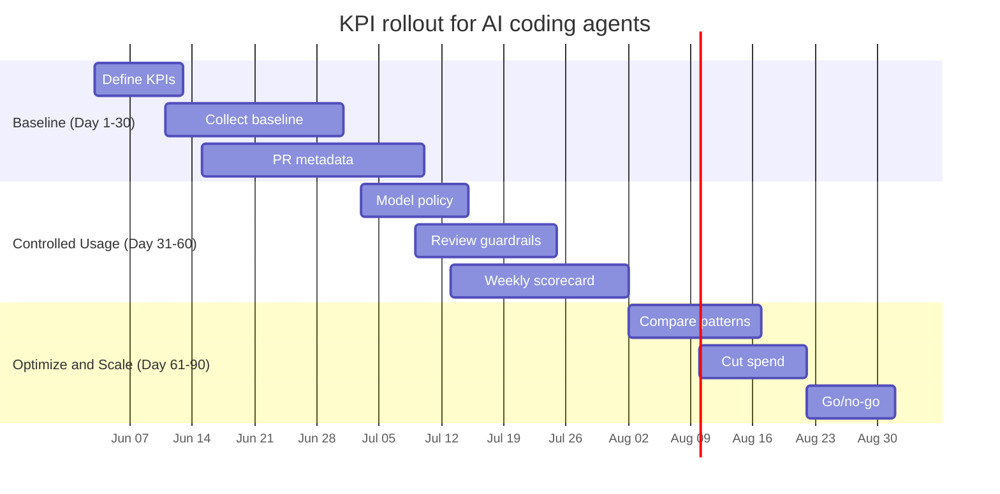

A quick chat question using GPT-5 mini costs roughly **$0.0015**. A multi-file refactor using GPT-5.5 costs around **$5.50**.
Same developer. Same day. More than **3,600x** cost difference. (Both numbers come from the published per-token rates worked through in [the previous post](/the-real-cost-of-ai-coding-agents.html).)

That was the main point of that post: agentic coding breaks flat-rate mental models. Under usage-based billing, the same team can look cheap on seat price and expensive on actual usage.

This post is the follow-up: if your bill is now variable, what should you measure?

Not just cost. Cost alone will make teams defensive. Productivity alone will make finance nervous. You need a scorecard that puts **speed, quality, reliability, and spend** in the same conversation.

Here is the practical version I would start with.

<div class="tip" markdown="1">
**Short version:** do not measure AI coding agents only by seat price, lines of code, or developer sentiment. Measure the full loop: delivery speed, review quality, production safety, and AI credits consumed.
</div>

---

## What the cost post already established

The pricing mechanics matter because they define what you can measure.

From GitHub's usage-based billing docs and announcement:

- 1 GitHub AI Credit = **$0.01 USD**
- Copilot Business includes **1,900 credits/user/month**, pooled at the billing entity level
- Copilot Enterprise includes **3,900 credits/user/month**, pooled at the billing entity level
- existing Business customers get **3,000 credits/user/month** during the promotional period (June 1 – September 1, 2026)
- existing Enterprise customers get **7,000 credits/user/month** during the same window
- code completions and Next Edit Suggestions remain included on paid plans and do not consume AI Credits
- chat, agent sessions, Copilot CLI, cloud agent, Spaces, Spark, and third-party coding agents consume AI Credits
- Copilot code review also consumes GitHub Actions minutes on GitHub-hosted runners
- usage reports expose `aic_quantity` and `aic_gross_amount` so admins can estimate spend under the new model

That means the useful unit is no longer "Copilot seats". It is **AI credits per useful engineering outcome**.

If your team uses Claude Code, Cursor, or direct API access instead of Copilot, the credit language does not apply, but the structure does. Substitute tokens consumed or dollars billed wherever I write "credits" below. The KPI logic is the same.

The previous post used this 10-person Copilot Business example:

| Team type | Daily usage pattern | Monthly credit burn | Overage |
|-----------|--------------------|--------------------|---------|
| Light | A few chats, rare agent use | ~8,000 credits | None |
| Moderate | About $12.50/day across the team | ~25,000 credits | ~$60 |
| Heavy | About $25/day across the team | ~50,000 credits | ~$310 |

Those are illustrative scenarios, not GitHub-published averages. But they are useful because they show the shape of the problem: the sticker price for 10 Business seats is **$190/month**, while a heavy team can behave more like a **$500/month** team once overage is included.

That is still cheap if quality and speed improve. It is expensive if the team is burning frontier models on trivial work and creating rework.

That is why you need KPIs.

---

## The measurement gap

Most teams still evaluate AI coding with weak proxies:

- lines of code written
- number of prompts
- monthly spend without usage context
- vague "dev happiness" signals

These are easy to collect and hard to use.

If you want to know whether AI is helping engineering, you need four buckets:

1. **Speed**: are we shipping faster?
2. **Quality**: are we creating less rework?
3. **Reliability**: is delivery more predictable?
4. **Cost**: is AI spend buying useful outcomes?

---

## The KPI model

Start small. Ten to twelve metrics is enough. More than that and the dashboard becomes a hobby.

### Speed metrics

| KPI | Why it matters | How to calculate |
|-----|----------------|------------------|
| Lead time for change | End-to-end delivery speed | PR open → production deploy |
| Time to first reviewed PR | Speed of first delivery on new work | Ticket start → first PR opened for review |
| Review cycle count | Detects churn | Average review rounds per PR |

### Quality metrics

| KPI | Why it matters | How to calculate |
|-----|----------------|------------------|
| Rework rate | Captures avoidable re-edits | % PRs with >2 major revision rounds |
| Escaped defects | Tracks production quality | Bugs filed within 7 days of release |
| Test coverage delta | Prevents "fast but fragile" output | Coverage change per merged PR |

### Reliability metrics

| KPI | Why it matters | How to calculate |
|-----|----------------|------------------|
| Change failure rate | Core delivery health signal | % releases causing incident/rollback |
| Rollback frequency | Flags risky merges | Rollbacks per sprint |
| First-run CI pass rate | Measures release stability | % pipelines passing without rerun |

### Cost metrics

| KPI | Why it matters | How to calculate |
|-----|----------------|------------------|
| AI credits per merged PR | Normalizes usage to output | `aic_quantity` / merged PRs |
| Gross AI cost per merged PR | Converts usage to money | `aic_gross_amount` / merged PRs |
| Overage exposure | Shows budget risk | Gross usage - included credit pool |
| Heavy-user share | Finds expensive patterns | % spend from top 10% of users |

Notice the wording: **AI credits per merged PR**, not just cost per PR. Dollars are useful for finance. Credits are useful for engineering operations because they map directly to model choice, context size, and agent behavior.

One metric on the quality table misleads more than the others: **review cycle count**. When it falls, the easy read is that code quality improved. The more common explanation is that reviewers started rubber-stamping AI-generated PRs because the volume went up and the detail became harder to challenge. Track it alongside escaped defects, not on its own.

---

## A scorecard you can actually run

You do not need a giant BI project. A weekly one-page scorecard is enough.

Here is an illustrative scorecard for a 10-person Copilot Business team in the first month after the promotional period ends (so 1,900 × 10 = 19,000 included credits/month), with usage projected from the first two weeks of the month.

| KPI | Baseline | Current | Trend | Status |
|-----|----------|---------|-------|--------|
| Lead time for change | 4.8 days | 3.9 days | ↓ 19% | 🟢 |
| Review cycle count | 2.6 | 2.1 | ↓ 19% | 🟢 |
| Escaped defects / sprint | 6 | 7 | ↑ 17% | 🟡 |
| First-run CI pass rate | 71% | 79% | ↑ 8 pts | 🟢 |
| Monthly AI credits | 19,000 included | 25,000 projected | +6,000 over | ℹ️ |
| Projected overage | $0 | ~$60 | New cost line | ℹ️ |
| Heavy-user share | not yet measured | ~40% from top 10% of users | first reading | ℹ️ |

> Use your own baseline and thresholds. The table above is an example layout, not a benchmark claim.

The point is not that $60 overage is bad. It probably is not. The point is that you can now ask the right question: did the extra 6,000 credits buy faster delivery, less rework, or better reliability?

This also keeps the post aligned with the earlier budget recommendation: teams that take agent mode seriously should not plan around the $19 Business sticker price alone. A more honest planning envelope is still **$40-$60 per engineer per month**, then refine from real usage.

---

## 30-60-90 rollout plan



### Days 1-30: baseline and instrumentation

- Select one pilot team (5-12 engineers)
- Freeze KPI definitions in writing
- Capture pre-AI baseline where possible
- Download the Copilot usage report if you are already using Copilot Business or Enterprise
- Add PR tags:
  - `ai-assisted: yes/no`
  - `workflow: single-agent | tools | multi-agent`
  - `model-tier: low | mid | frontier`
- Track `aic_quantity` and `aic_gross_amount` from the usage report

<div class="warning" markdown="1">
**Attribution is hard, and self-reporting is unreliable.** Developers forget the tag, disagree on what counts as "AI-assisted", or game it once they realize it is being measured. Treat PR tags as a weak hint, not ground truth. The stronger signals are:

- Copilot usage metrics at the organization level, joined to team membership where needed and correlated with PR throughput over the same window
- commits authored by `copilot[bot]` or your cloud agent's service account
- Pull request creators on agent-initiated PRs (Copilot cloud agent, Devin, Codex)

Use PR tags to enrich the picture, not to drive the cost-per-PR calculation.
</div>

### No baseline? Don't fake one

Most teams asking these questions have never tracked DORA, let alone an AI-specific scorecard. That is fine. Three workable ways to get a baseline without rewriting history:

- **Pre-period freeze (4 weeks).** Turn instrumentation on, change nothing else for four weeks, then start rollout. The pre-period becomes your baseline.
- **Pilot vs control.** Roll out to one team, hold a comparable team flat for one quarter. Compare deltas, not absolutes.
- **Phased ramp.** Stage the rollout (chat → agent mode → cloud agent) and treat each phase boundary as a checkpoint.

What does not work: claiming a baseline from gut feel, or comparing this quarter to "last year, roughly". If you cannot defend the baseline in a 5-minute conversation, throw it out and use a pilot vs control instead.

### Days 31-60: controlled usage patterns

- Set a default model policy (cheap by default, frontier by exception)
- Define approved high-cost cases (hard debugging, architecture spikes, incident response)
- Decide whether budgets should alert only or stop usage when exhausted
- Add lightweight checks for AI-heavy PRs:
  - tests included
  - security-sensitive changes flagged
  - spec/task link present for non-trivial changes

<div class="tip" markdown="1">
**Platform-level enforcement:** as of May 26, 2026, GitHub added [targeted model rules](https://github.blog/changelog/2026-05-26-target-copilot-models-to-organizations-with-model-rules/) for enterprise owners. You can now configure which Copilot models are available per organization, and set each model's availability to **Enabled** (automatically on for all orgs) or **Optional** (each org decides whether to enable it). This moves model policy from team convention into platform configuration, so "cheap by default, frontier by exception" becomes enforceable rather than advisory. Available to Copilot Business and Copilot Enterprise customers.
</div>

### Days 61-90: optimize and decide

- Compare high-performing and low-performing PR patterns
- Promote what works into team conventions
- Remove expensive patterns with no quality lift
- Tune budgets by team/workflow instead of using one blunt cap for everyone
- Decide scaling path: expand, hold, or redesign

---

## Where each metric comes from

| Source | Gives you |
|--------|-----------|
| Git metadata + PR events | Lead time, review rounds, merge velocity |
| CI/CD system | First-run pass rate, failure rate, rollback signals |
| Issue tracker | Escaped defects, rework linkage |
| Copilot usage report / billing dashboard | `aic_quantity`, `aic_gross_amount`, model mix, spend concentration |
| Spec and task artifacts | Plan adherence, scope control, handoff quality |

If you are running spec-driven workflows, add one extra KPI:

**Spec adherence score** = % of implemented tasks traceable to approved spec/task artifacts.

That catches silent scope creep early.

I would treat this as an internal quality signal, not an industry benchmark. There is no universal number here. A team doing small maintenance work will look different from a team shipping a new product slice with Spec-Kit or OpenSpec.

---

## How GitHub itself frames this: ESSP, DORA, and the Copilot dashboards

You do not have to invent this framework from scratch. GitHub already publishes one and ships dashboards to power it.

### The Engineering System Success Playbook (ESSP)

GitHub's [Engineering System Success Playbook](https://github.com/resources/insights/engineering-system-success-playbook) is their answer to "how should we measure an engineering org in the AI era?" It is built around four zones working together, not in isolation:

- **Quality**: defects, change failure rate, security
- **Velocity**: throughput, lead time, deployment frequency
- **Developer happiness**: friction, satisfaction, retention signals
- **Business outcomes**: how engineering work ties back to revenue, cost, and customer impact

ESSP itself lists 12 metrics in total, three per zone. That is roughly the size of the scorecard above, and not by accident.

GitHub explicitly positions ESSP as the framework they used internally to roll out Copilot at scale. The big idea: optimizing one zone in isolation produces bad outcomes. Speed without quality creates debt. Quality without velocity creates stagnation. Happiness without either is a comfort trap. Business outcomes without the other three is a number on a slide that nobody on the team recognises.

Map that onto the scorecard above:

| ESSP zone | KPIs from this post |
|-----------|---------------------|
| Quality | First-run CI pass rate, defect escape rate, rollback rate |
| Velocity | Lead time, PRs/week, time to first reviewed PR |
| Developer happiness | Quarterly DX pulse survey (see below) |
| Business outcomes | AI credits per merged PR, gross AI cost per merged PR, overage exposure |

Spend that buys velocity at the expense of quality is not a win. Spend that buys nothing measurable in any of the other three zones is not a win either.

Developer happiness is the one zone you cannot get from logs. The honest measurement is a short pulse survey, not heavy-user share or model mix. A workable starter, borrowed from the [SPACE framework](https://queue.acm.org/detail.cfm?id=3454124), is four questions on a 1–5 scale every quarter:

1. How satisfied are you with your AI tooling this quarter?
2. How often does it block or slow you down?
3. How much trust do you have in its output for production code?
4. Would you recommend the current setup to a peer team?

Track the trend, not the absolute score. A sustained drop in question 3 is a leading indicator of rework before it shows up in defect data.

<div class="warning" markdown="1">
**Hard rule:** none of these KPIs belong in individual performance reviews. They are team-level signals. Aggregate at the team or org level, never at the engineer level. Older aggregate Copilot metrics enforced a 5-license floor for a reason, and the newer usage reports can expose richer user-level data to authorized admins. That makes the governance rule more important, not less. Individual-level scoring of AI usage breaks trust faster than any cost overrun. If you operate in the EU, loop in your works council before rolling out any per-developer tracking.
</div>

### DORA, the GitHub way

ESSP sits on top of [DORA](https://dora.dev/), the four metrics every platform team knows:

- **Deployment frequency**: how often you ship to production
- **Lead time for changes**: commit to production
- **Change failure rate**: % of deploys causing incidents/rollbacks
- **Failed deployment recovery time** (historically MTTR): how fast you recover from failures

DORA added **reliability** as a fifth metric in the 2023 report. The classic four are still the operational core; treat reliability as a separate signal when you have the data to back it.

GitHub provides direct hooks for all four through GitHub Actions, Deployments, the Checks API, and Issues. Several community Actions and partner integrations (Sleuth, LinearB, Faros) already feed DORA dashboards from this data. If you are on GitHub Enterprise, you already own the raw events. The work is wiring them together, not collecting them.

One honest caveat: DORA was designed around human commits. Agent-initiated PRs and cloud agent runs blur the lead time definition. A PR opened by `copilot[bot]` does not cleanly map to "commit to production" when a human still reviews and merges it. No consensus exists yet on how to count this. Track DORA from human-initiated work as your baseline and flag agent-initiated PRs separately until the tooling catches up.

### The Copilot dashboards you get out of the box

For the AI side of the scorecard, GitHub Enterprise and Business admins get three first-party surfaces:

**1. Copilot metrics dashboard**: built into organization and enterprise settings. Aggregates engagement and feature usage with breakdowns by editor, language, and model. Good for "who is actually using this, on what, and where".

**2. Copilot usage metrics REST API**: the machine-readable export path for BI tools. This is the current report-based API, not the older `/orgs/{org}/copilot/metrics` endpoint that closed on April 2, 2026.

```bash
# Latest 28-day organization usage report
curl -L \
  -H "Accept: application/vnd.github+json" \
  -H "Authorization: Bearer $TOKEN" \
  -H "X-GitHub-Api-Version: 2026-03-10" \
  https://api.github.com/orgs/ORG/copilot/metrics/reports/organization-28-day/latest

# Single-day organization usage report
curl -L \
  -H "Accept: application/vnd.github+json" \
  -H "Authorization: Bearer $TOKEN" \
  -H "X-GitHub-Api-Version: 2026-03-10" \
  "https://api.github.com/orgs/ORG/copilot/metrics/reports/organization-1-day?day=2026-06-02"
```

A trimmed response looks like this:

```json
{
  "download_links": [
    "https://example.com/copilot-usage-report-1.json",
    "https://example.com/copilot-usage-report-2.json"
  ],
  "report_start_day": "2026-05-06",
  "report_end_day": "2026-06-02"
}
```

A few things worth knowing before you wire this up:

- The current usage metrics API returns signed download links to report files. Build your pipeline around fetching and storing those files, not around one inline JSON payload.
- Reports are generated daily and include complete days only. Do not expect same-hour freshness.
- The newer reports include richer organization, enterprise, user, and user-team views. Use the user-level views to aggregate to teams and find enablement gaps, not to rank developers.
- The legacy Copilot metrics endpoints were closed down on **April 2, 2026**. If an internal dashboard still calls `/copilot/metrics`, fix that before building anything new on top of it.

**3. Copilot activity report**: a separate CSV-style report for license hygiene, not productivity. It tracks `last_activity_at` per user (90-day retention) so admins can reclaim seats from inactive users. Pair this with the metrics API: the API tells you what your engaged users are doing, the activity report tells you who has gone dark.

### Suggested wiring

A workable starter stack for a Copilot Business or Enterprise customer:

| Layer | Source | Refresh |
|-------|--------|---------|
| Cost & credits | Usage report (`aic_quantity`, `aic_gross_amount`) | Daily |
| Engagement & feature mix | Copilot metrics dashboard + usage metrics API reports | Daily |
| License hygiene | Copilot activity report (`last_activity_at`) | Daily |
| DORA + delivery | GitHub Actions, Deployments, Checks, Issues | Per event |
| Spec adherence | Spec/task artifacts in repo | Per PR |

Stream all of it into one BI tool (Looker Studio, Power BI, Metabase) and you have the scorecard from this post without buying a separate platform.

<div class="tip" markdown="1">
**One caveat:** the Copilot usage metrics API and dashboard only cover GitHub Copilot. If you run Claude Code, Cursor, or direct API access alongside it, you will still need to instrument those separately:

- **Anthropic / Claude Code**: Anthropic Console → Usage and Cost reports, plus the Admin API for programmatic access
- **OpenAI / direct API**: OpenAI platform → Usage dashboard and the `/v1/usage` endpoint
- **Cursor**: Cursor Admin dashboard for team usage, with SAML/SCIM-gated exports on Business and Enterprise plans
- **Anything else**: if the vendor cannot show you per-team token or request counts, that is itself a KPI signal
</div>

---

## Failure modes to avoid

<div class="warning" markdown="1">
**Common trap:** teams celebrate speed improvements while defect leakage rises.

Always pair at least one speed KPI with one quality KPI in the same review. Never read them in isolation.
</div>

### 1) Vanity speed wins

Lead time drops. Defects rise. Team celebrates anyway.

**Fix:** pair every speed KPI with a quality KPI.

### 2) Cost panic, then productivity collapse

Finance sees a spike. Team gets hard limits overnight. Engineers stop using agents for useful work.

**Fix:** start with alerts at 75%, 90%, and 100%. Use hard stops deliberately. A hard stop is useful for runaway usage; it is painful when it blocks a developer halfway through legitimate work.

### 3) One-model policy for all tasks

The same expensive model gets used for tiny edits and hard architecture work.

**Fix:** route by task class:

- low-cost models for routine edits/tests/docs
- mid-tier models for normal multi-file implementation
- frontier models for ambiguous, high-risk, or architecture-heavy work

GitHub's [targeted model rules](https://github.blog/changelog/2026-05-26-target-copilot-models-to-organizations-with-model-rules/) (released May 26, 2026) give enterprise admins a platform-level mechanism to enforce this tiering. Setting frontier models to *Optional* means organizations must explicitly opt in to enable them, rather than having every engineer reach for GPT-5.5 or Claude Opus 4.8 by default. You can also create targeted rules that allow specific models only for selected organizations, which is useful when one team legitimately needs frontier access and others do not.

### 4) Metric gaming (Goodhart's Law)

People optimize what is visible and ignore what matters.

**Fix:** rotate one secondary KPI each quarter and audit behavior, not just numbers.

---

## What good looks like after 90 days

You do not need every metric to improve.

A healthy pattern usually looks like this:

- speed improves clearly
- quality stays stable or improves slightly
- reliability improves slowly (often lags)
- AI credits rise, but slower than delivered value

If speed improves 20% and escaped defects double, that is not progress.
If AI credit usage rises 30% while lead time drops 25% and rework drops 20%, that is often a good trade.

---

## Minimum viable dashboard

If you only track five metrics this month, track these:

1. Lead time for change
2. Review cycle count
3. Escaped defects per sprint
4. First-run CI pass rate
5. AI credits per merged PR

That is enough to answer the one question leadership eventually asks:

**Should we scale this, pause this, or change how we use it?**

Without KPIs, that decision is politics.
With KPIs, it is engineering.

---

## Honest disclaimer: nobody has this fully figured out

Everything above is a working framework, not a settled one.

Usage-based billing for AI coding has barely started in most organisations. GitHub's AI Credits model launches on June 1, 2026, just days after this post is dated. The first-generation Copilot metrics API has only been GA since October 2024, and the current report-based usage metrics API and `aic_*` fields are much newer than that. There is no five-year benchmark dataset to point at, no industry-standard scorecard, and no consultancy that has run this playbook through a full annual cycle. Anyone selling you certainty here is selling you something.

What is actually happening, across most engineering orgs right now: people are entering the first month under the new pricing, reading the billing docs for the first time, and trying to figure out which model choices and which workflows will actually be worth the spend. Token optimization is a live research problem, not a solved one. Best practices are being written in public, in real time, by people who are equally in the dark.

That is why the community tooling matters. A few examples worth knowing:

- **[Xebia's GitHub Copilot Premium Requests Usage Analyzer](https://xebia.github.io/github-copilot-premium-reqs-usage/)** is a single-page app that [Jesse Houwing](https://github.com/jessehouwing) pointed me to for the billing transition. It takes the CSV export from GitHub's Billing → Usage page and visualizes it locally: usage over time, distribution by model, compliant vs. quota-exceeding requests. Data stays in your browser, code is open source on [github.com/xebia/github-copilot-premium-reqs-usage](https://github.com/xebia/github-copilot-premium-reqs-usage). The fastest way to see where your premium requests are going without setting up a BI pipeline first.
- **[Xebia's Copilot Billing Preview](https://copilot-billing.xebia.ms/)** is the practical next step for the June 2026 billing switch. Upload the Premium Request Usage report CSV from GitHub's Billing and licensing → Preview your billing impact page, and it previews what that usage would look like under AI Credits. It is browser-only: the CSV is not uploaded, stored, cached, or sent over the network. Treat the numbers as indicative, not a bill, but it is a useful first check before building your own dashboard.
- **[Rob Bos's AI Engineering Fluency](https://github.com/rajbos/ai-engineering-fluency)** is a VS Code extension (also for JetBrains and CLI) that reads local session logs from GitHub Copilot, Claude Code, Gemini CLI, Cursor, and a dozen other tools. It shows token usage per model, per editor, per session, and per day, with estimated cost over time. The **Fluency Score** is the most interesting part: it maps your usage patterns against six dimensions (prompt engineering, context engineering, agentic usage, tool usage, customization, workflow integration) and places each on a four-stage scale from Skeptic to AI Strategist. Works for individual devs checking their own habits and for leads who want to see where the team is stuck at stage one. Free, MIT licensed, all data stays local. Install from the [VS Code Marketplace](https://marketplace.visualstudio.com/items?itemName=RobBos.ai-engineering-fluency) or run `npx @rajbos/ai-engineering-fluency stats` from the terminal.
- **GitHub's own Copilot metrics dashboard**: the official in-product surface, available to Business and Enterprise admins.
- **Vendor admin dashboards** for Anthropic, OpenAI, and Cursor (covered above).

None of these tools give you the full picture on their own. The scorecard in this post is my current best attempt to combine them into something a leadership team can act on. Expect it to change. Expect your own version to look different in six months. That is the work.

If you have a better dashboard, a sharper metric, or a war story about a KPI that backfired, I want to hear it. We are all writing this playbook together.

---

## Closing thought

Most teams do not fail with AI coding agents because the models are bad. They fail because they cannot separate speed gains from quality debt and cost noise. By the time finance notices the bill, the conversation is already defensive.

A scorecard is not optional anymore. It is the only thing that lets you say "yes, expand this", "no, pull this back", or "change how we use it" without it being a fight.

Keep it boring. Keep it team-level. Tie every number to a decision someone will actually make.

Then you can argue about prompts and model mix all day, because the foundation is no longer the argument.

---

## Related reading

- [The real cost of AI coding agents: what your team actually spends](/the-real-cost-of-ai-coding-agents.html)
- [Single-agent, tools, or a team? A practical comparison of AI coding setups](/single-agent-tools-or-a-team.html)
- [From Vibe Coding to Spec-Driven Development: Part 1](/from-vibe-coding-to-spec-driven-development.html)

---

## Sources

- [GitHub Copilot is moving to usage-based billing](https://github.blog/news-insights/company-news/github-copilot-is-moving-to-usage-based-billing/)
- [GitHub Copilot individual plans: Introducing flex allotments in Pro and Pro+, and a new Max plan](https://github.blog/news-insights/company-news/github-copilot-individual-plans-introducing-flex-allotments-in-pro-and-pro-and-a-new-max-plan/)
- [Usage-based billing for organizations and enterprises](https://docs.github.com/en/copilot/concepts/billing/usage-based-billing-for-organizations-and-enterprises)
- [Models and pricing for GitHub Copilot](https://docs.github.com/en/copilot/reference/copilot-billing/models-and-pricing)
- [Preparing your organization for usage-based billing](https://docs.github.com/en/copilot/how-tos/manage-and-track-spending/prepare-for-usage-based-billing)
- [Setting up budgets to control spending on metered products](https://docs.github.com/en/billing/how-tos/set-up-budgets)
- [GitHub's Engineering System Success Playbook (ESSP)](https://github.com/resources/insights/engineering-system-success-playbook)
- [REST API endpoints for Copilot usage metrics](https://docs.github.com/en/rest/copilot/copilot-usage-metrics)
- [Closing down notice of legacy Copilot metrics APIs](https://github.blog/changelog/2026-01-29-closing-down-notice-of-legacy-copilot-metrics-apis/)
- [Copilot cloud agent fields added to usage metrics](https://github.blog/changelog/2026-04-23-copilot-cloud-agent-fields-added-to-usage-metrics/)
- [Metrics data properties for GitHub Copilot](https://docs.github.com/en/copilot/reference/metrics-data)
- [DORA: the four key DevOps metrics](https://dora.dev/)
- [The SPACE of Developer Productivity (ACM Queue)](https://queue.acm.org/detail.cfm?id=3454124)
- [Xebia GitHub Copilot Premium Requests Usage Analyzer (open source)](https://github.com/xebia/github-copilot-premium-reqs-usage)
- [Xebia Copilot Billing Preview](https://copilot-billing.xebia.ms/)
- [AI Engineering Fluency by Rob Bos (open source)](https://github.com/rajbos/ai-engineering-fluency)
- [AI Engineering Fluency: tracking your AI coding habits (devopsjournal.io)](https://devopsjournal.io/blog/2026/05/15/ai-engineering-fluency-extension)
- [Target Copilot models to organizations with model rules](https://github.blog/changelog/2026-05-26-target-copilot-models-to-organizations-with-model-rules/)
- [Managing availability of default models (GitHub Docs)](https://docs.github.com/copilot/how-tos/administer-copilot/manage-for-enterprise/manage-availability-of-default-models)
