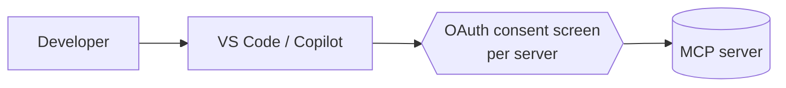
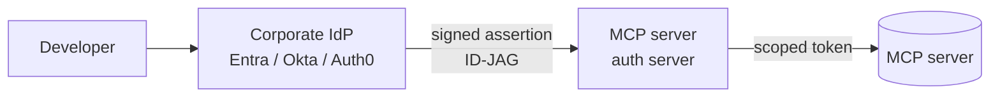

MCP spread fast because it was easy to try. You point Copilot or Claude at a server, click through an OAuth prompt, and you're connected to GitHub or Linear or Jira. Five minutes, done.

That same simplicity is what made enterprise IT nervous. Every developer connecting MCP servers by hand means no central policy, no unified audit trail, and a slow leak of personal accounts mixed into work sessions. Security teams had no good answer to "which servers is this developer actually talking to?"

Two things changed in quick succession. On June 3, VS Code 1.123 shipped enterprise-managed MCP authentication as Preview, with Entra ID, Okta, and Auth0 all supported out of the box. Then on June 18, the [Enterprise-Managed Authorization](https://modelcontextprotocol.io/extensions/auth/enterprise-managed-authorization) extension for MCP itself went stable, with Anthropic also shipping support alongside Microsoft. If you run a Microsoft stack (VS Code, GitHub Copilot, Entra ID), the pieces are already there.

---

## The problem it solves

If you're running agents at any scale in an organization, the OAuth-per-server model has three hard problems.

**No central control.** An admin can't grant or revoke access to a specific MCP server without reaching into each developer's client config. There's no place to say "the security team can use the GitHub MCP server, the sales team can use the Salesforce one."

**No shared audit trail.** Every OAuth token is issued independently. There's no single log that shows which agents connected to which servers, on whose behalf, and when.

**Personal and work accounts mix.** When users authorize servers by hand, there's nothing stopping them from connecting their personal GitHub account to a work Copilot session, intentionally or not.

These aren't edge cases. They're the exact blockers that keep enterprise IT from saying yes to agent deployments.

---

## How it works

Enterprise-Managed Authorization moves the authorization decision from the user to the identity provider, the same system that already controls which apps employees can access.

The flow without this extension, a consent screen for every server:



The flow with Enterprise-Managed Authorization, one sign-in, no consent screen:



The key difference: the consent screen is gone. During single sign-on, VS Code exchanges the developer's IdP identity for a resource-scoped assertion using [ID-JAG](https://datatracker.ietf.org/doc/draft-ietf-oauth-identity-assertion-authz-grant/) (Identity Assertion JWT Authorization Grant). It then redeems that assertion at the MCP server's authorization server for an access token scoped to that resource. One sign-in, every permitted server automatically connected.

{: .important }
The consent-screen-per-server step disappears entirely. The authorization decision moves from the developer clicking "allow" to the IdP policy your admins already manage.

Okta calls their implementation [Cross App Access (XAA)](https://www.okta.com/identity-101/cross-app-access-securing-ai-agent-and-app-to-app-connections/). The underlying ID-JAG standard is an IETF draft, so any identity provider can implement it.

From a developer perspective, the experience is simpler: log in once, all your permitted MCP connectors are automatically set up. Tom Moor, Head of Engineering at Linear, described it as "pretty magical" in the release announcement. From an IT perspective, the whole thing is policy-driven and auditable.

---

## What IT actually gets

Once an identity provider is in the loop, a few things change for security and compliance teams.

**Centralized access control.** An admin enables a server for the organization, a team, or a role. Developers inherit access based on their existing group memberships, with no individual approvals needed. Revocation runs the same path: deactivate a user in Entra or Okta, and their MCP access goes with it.

**One audit trail.** Access decisions live in the IdP admin console, with one auditable trail across every connector. There's one place to ask "what did this person have access to?"

**No more account mixing.** The interactive account selection step is gone. Connecting a personal GitHub account to a work Copilot session, accidentally or on purpose, becomes structurally much harder when the IdP controls the connection.

**Agent identities (Anthropic-specific).** Anthropic's implementation goes a step further: Claude Managed Agents can be imported into the corporate directory and treated as first-class identities with human owners. That's not in the MCP spec itself, but it's part of what Anthropic shipped on top of it.

Here's how the admin side maps to what IT already does:

| Before | After |
|--------|-------|
| Developer clicks through OAuth per server | Admin enables server in IdP once |
| No way to audit which servers developers access | Full audit trail in IdP console |
| Revoking access is manual, per-server | Deactivating user in IdP cuts MCP access |
| No concept of "agent" identity | Anthropic's impl: agents imported into directory with owners |
| Personal and work accounts mix | Structurally separated by IdP policy |

---

## Setting it up in VS Code

VS Code 1.123 ships enterprise-managed MCP authentication as Preview. There are two moving parts: the admin-side IdP config and the per-server opt-in in `mcp.json`.

**Admin configuration.** The IdP is set through a policy-managed setting: `mcp.enterpriseManagedAuth.idp`. Because it's policy-backed, it doesn't sync through Settings Sync. It's delivered through the usual MDM channels:

- **Windows**: Group Policy
- **macOS**: managed preferences
- **Linux**: `/etc/vscode/policy.json`

This keeps the IdP config in IT's hands, not the developer's.

**Server opt-in.** Individual MCP servers in `mcp.json` opt in to the enterprise auth flow with `"enterpriseManaged": true` in their `oauth` block:

```json
"my-mcp-server": {
  "url": "https://mcp.example.com/mcp",
  "type": "http",
  "oauth": {
    "enterpriseManaged": true
  }
}
```

When that flag is present, VS Code routes the server through the XAA provider instead of the standard per-server Dynamic Client Registration path. Servers without the flag continue using standard OAuth, so the two flows coexist.

Separately, the same 1.123 release added the ability to pin a pre-registered OAuth `clientId` (and store a client secret in VS Code's OS-backed secret storage rather than plaintext config). That's a distinct feature from enterprise-managed auth (useful when a server expects a specific registered client instead of Dynamic Client Registration), but worth knowing about if you're hand-configuring servers.

---

## GitHub Enterprise already had the first lever

Before EMA shipped, GitHub Enterprise admins could already control MCP server access through a separate mechanism: the [MCP registry and policy settings](https://docs.github.com/en/copilot/concepts/mcp-management) in the GitHub Copilot admin console.

Three policy settings are available at the organization or enterprise level:

- **MCP servers in Copilot**: enable or disable MCP entirely for all Copilot seats in the organization
- **MCP Registry URL**: point to your own registry of approved servers, a catalog developers can discover and use without leaving their IDE
- **Restrict MCP access to registry servers**: flip this on, and developers can only connect to servers on your list

That third setting is allowlist enforcement. It's enforced across VS Code, Copilot CLI, Visual Studio, Eclipse, JetBrains, and Xcode (the last three in pre-release). The Copilot cloud agent doesn't support allowlist enforcement yet.

So GitHub Enterprise customers already had a governance lever before EMA: control which servers are permitted. What EMA adds is a separate layer controlling how authentication happens for those servers.

{: .tip }
A fully governed Copilot MCP setup uses both levers together: the registry allowlist decides which servers are in scope, EMA handles authentication for everything on that list.

The two levers are complementary and answer different questions:

| Layer | What it controls | How it's set |
|-------|-----------------|-------------|
| **MCP Registry + policy** | Which servers are permitted | GitHub admin console, per org/enterprise |
| **EMA (VS Code / EMA spec)** | How authentication happens | IdP policy + `mcp.json` per server |

A fully governed Copilot MCP setup uses both: the registry allowlist decides what's in scope, EMA handles authentication for everything in that list.

---

## What's supported right now

**VS Code 1.123 (Preview):** Enterprise-managed MCP authentication shipped in the June 3 release. Supported identity providers in VS Code: **Entra ID, Okta, and Auth0**. If your organization is already on Microsoft's identity stack, Entra is supported today. GitHub Copilot in VS Code runs on the same MCP layer, so Copilot agent mode with MCP tools goes through the same enterprise auth flow.

**Anthropic (stable):** Claude, Claude Code, and Cowork support the extension across Anthropic's shared MCP layer. Admins can authorize servers for users organization-wide from a single place.

**Identity providers:** Okta is the first to ship support at the MCP spec level, via [Cross App Access (XAA)](https://www.okta.com/identity-101/cross-app-access-securing-ai-agent-and-app-to-app-connections/). VS Code independently supports Entra and Auth0 on top of that.

**MCP servers shipping support:** Asana, Atlassian, Canva, Figma, Granola, Linear, Supabase. Slack is incoming.

If you're running a private MCP server inside your organization, the spec is at [modelcontextprotocol.io](https://modelcontextprotocol.io/extensions/auth/enterprise-managed-authorization) and VS Code's implementation details are in the [1.123 release notes](https://code.visualstudio.com/updates/v1_123#_enterprise-managed-mcp-authentication-preview). The extension works alongside standard OAuth, so servers without the `enterpriseManaged` flag fall back to the existing per-server flow.

---

## Why this matters beyond the login screen

If you're building or governing agent deployments, this is worth following closely for reasons that go beyond convenience.

**GitHub Copilot + MCP in the enterprise.** If you're using Copilot agent mode with MCP tools today, each server your agents connect to has been authorized individually by each developer. That's fine for a pilot. It doesn't work when you have 200 developers, each one potentially connecting different servers with different accounts. Enterprise-managed auth is the mechanism that makes Copilot MCP usage IT-governable rather than just developer-configurable.

**The CCoE question.** If you've set up an [AI Center of Excellence](/creating-ccoe-for-ai), one of the harder governance questions is: how do you actually control which agents connect to which systems? Before this extension, the answer was mostly "we hope people follow the policy." Now there's a mechanism.

**The single-agent vs. multi-agent question.** If you're running [multi-agent setups](/single-agent-tools-or-a-team), each agent potentially needs its own MCP connections. Managing OAuth per-agent per-server doesn't scale. Enterprise-Managed Authorization makes it feasible to give different agents different levels of access, all through the same IdP policy you already manage.

**The MCP baseline has shifted.** When I wrote [the original MCP post](/model-context-protocol-mcp) in May 2025, the story was "MCP is an open standard that makes tool integration simple." The story now is "MCP is an open standard that enterprises can actually govern." That's a different value proposition, and the one that unlocks real adoption inside large organizations.

---

## What to watch

A few things worth tracking as this matures:

{: .warning }
The **authorization vs. permissions gap** is still real. Enterprise-Managed Authorization controls who connects to what server. It does not control what actions a specific agent can take once connected. That's still the job of policy engines and gateways sitting between the agent and its tools. The two layers are complementary, but separate.

**ID-JAG** is still an IETF draft. Okta is the first IdP to ship at the MCP spec level. VS Code ships its own Entra ID and Auth0 support on top of that, but broader IdP adoption at the spec level is still ahead.

**The server-side Auth0 angle** is worth watching. VS Code already supports Auth0 as an IdP on the client side. The separate, still-emerging piece is Auth0 letting developers *expose* an MCP server with enterprise auth built in, so server authors don't implement ID-JAG from scratch. When that lands broadly, the supply of enterprise-ready servers grows quickly. That's the moment this goes from "enterprise feature" to "table stakes."

**The EMA Interest Group** is where the spec evolves. If you're building an MCP server or client and want input on compatibility or direction, the [EMA Interest Group](https://modelcontextprotocol.io/community/interest-groups/enterprise-managed-authorization) is the right place to track it.

---

## The short version

MCP's Enterprise-Managed Authorization extension is stable. Anthropic and Microsoft ship it in their clients. Okta ships it in their IdP. The consent-screen-per-server model is now optional.

For teams running agents in production: this is the governance primitive you were missing. The gap between "we can deploy agents" and "IT will allow us to deploy agents" just got smaller.

For teams planning agent deployments: if you were waiting for enterprise-grade auth to be part of MCP before committing, it's here.
