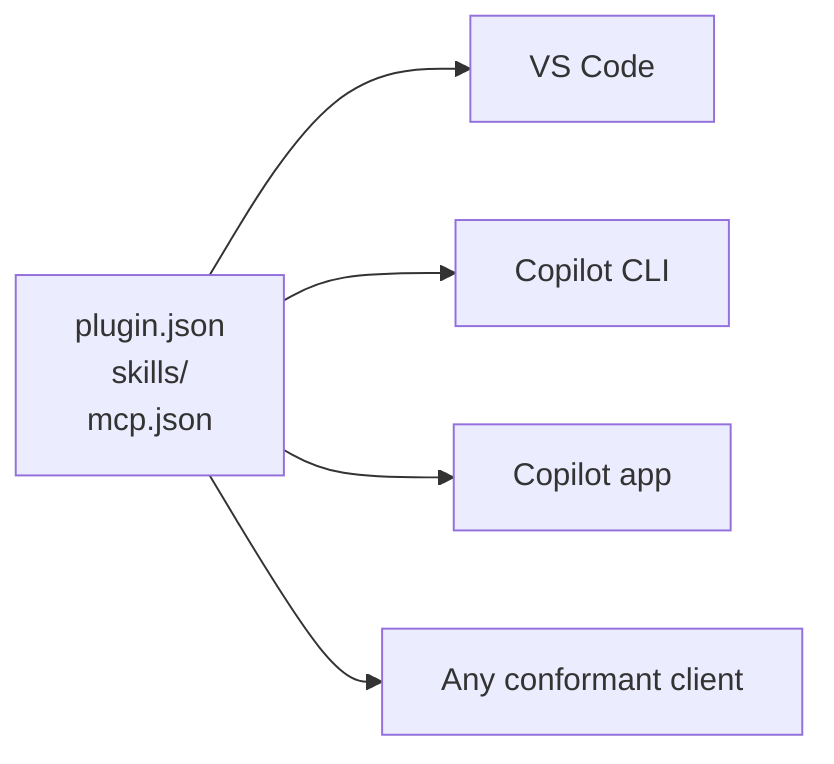

```text
my-plugin/
├── plugin.json
├── skills/
│   └── deploy/
│       └── SKILL.md
├── mcp.json
└── com.github.copilot/
    └── agents/
        └── reviewer.agent.md
```

That directory is an Agent Plugins 1.0 package. The skill and MCP configuration are portable. The custom Copilot agent is not, but it can stay in the same package under `com.github.copilot/`. A client that does not understand that namespace ignores it.

It solves a specific maintenance problem. If a platform team wants to distribute the same deployment skill and MCP server to several clients that support Agent Plugins 1.0, it should not need a different wrapper for each one. With Agent Plugins 1.0, the team can maintain one portable core and keep client-specific additions beside it in namespaced directories.

That means fewer manifests to update, fewer copies that can drift, and one package that compatible clients can consume through their own installation mechanisms. It does **not** make every customization portable or guarantee that a skill behaves identically in every client. The client still decides which component types it supports and how installation, permissions, and trust work.

This is a small standard on purpose. It does not standardize marketplaces, installation, updates, permissions, trust prompts, or every kind of agent customization. It gives compatible clients a shared layout for two things: Agent Skills and MCP server configuration.

The [specification repository marked version 1.0.0 as published on July 27](https://github.com/agentplugins/agent-plugins-spec/commit/f24daf829224fd7fb685ae117c518ea27cbe7b9e). GitHub's [August 12 announcement](https://github.blog/changelog/2026-08-12-agent-plugins-1-0-in-vs-code-copilot-cli-and-the-copilot-app) dates the public launch to August 6 and announced general availability in VS Code, GitHub Copilot CLI, the Copilot SDK, and the Copilot app on all Copilot plans.

---

## The packaging problem

Before Agent Plugins 1.0, the same skill and MCP server could need different packaging depending on the plugin format a client understood.

| Format | Manifest marker |
|--------|-----------------|
| Copilot | `plugin.json` without the Agent Plugins schema |
| Claude | `.claude-plugin/plugin.json` |
| Legacy OpenPlugin | `.plugin/plugin.json` |
| Agent Plugins 1.0 | `plugin.json` with the canonical Agent Plugins schema |

The component content could stay unchanged while manifests and directory layouts differed. That is the duplication this standard targets.

Consider a team publishing ten shared integrations. The duplication is not just cosmetic. Every release can require updating multiple manifests, testing multiple layouts, and checking that one client-specific package has not fallen behind. Agent Plugins moves that repeated work to one package boundary:

| Before | With Agent Plugins 1.0 |
|--------|------------------------|
| One wrapper per client format | One portable package for conformant clients |
| Repeated manifest and layout updates | One canonical manifest and layout |
| Separate copies can drift | Skills and MCP definitions have one source |
| Client-specific files mixed into each package | Client-specific files live in namespaced directories |

Compatible clients inspect the same package and load the component types they support:



Agent Plugins 1.0 standardizes package structure and component discovery. Distribution, installation, permissions, updates, trust behavior, and client extensions remain under each client's control.
{: .important }

---

## Who should use it

The strongest use case is not an individual with one local skill. It is a team or tool author distributing reusable capabilities:

- **Platform teams** publishing an internal catalog of approved skills and MCP integrations.
- **Tool vendors** supporting the same integration in more than one conformant agent client.
- **Open source maintainers** who want one portable package without giving up client-specific enhancements.
- **Enterprises** that want plugins to be an installable and governable unit in Copilot while keeping the portable components usable elsewhere.

If everything you maintain targets one client, your current format works, and you do not duplicate packages, migration buys you little. Agent Plugins is useful when it removes repeated packaging work—not because version 1.0 exists.

Portability also stops at the package boundary. A client may support skills, MCP servers, or both, and a skill can still depend on tools or behavior that another client does not provide. Use the shared format to remove packaging differences, then test the capability in every client you claim to support.
{: .important }

---

## The smallest valid plugin

A plugin is a directory. The smallest valid one contains one file, `plugin.json`, with two required fields:

```json
{
  "$schema": "https://agent-plugins.org/schemas/1.0.0/plugin.schema.json",
  "name": "my-dev-tools"
}
```

`$schema` selects the specification version. `name` must be 1 to 64 characters and use lowercase letters, numbers, hyphens, or periods. It must start and end with a letter or number, and it cannot contain `--` or `..`.

The optional fields are `version`, `description`, `author`, `homepage`, `repository`, `license`, `keywords`, and `extensions`. The manifest schema is closed. A client reports and ignores an unknown top-level field if the rest of the manifest is valid. Most other schema violations reject the plugin.

Components aren't declared in the manifest at all. They're discovered from two fixed locations:

```text
my-plugin/
├── plugin.json          # required, at the plugin root
├── skills/
│   └── test-runner/
│       ├── SKILL.md
│       └── scripts/
│           └── run-tests.sh
├── mcp.json              # MCP server definitions
└── com.github.copilot/   # client-specific extras, see below
```

Each immediate child directory under `skills/` is treated as a skill when it contains a regular file named `SKILL.md`. Clients do not search deeper descendants for additional skills. The file follows the same Agent Skills format I covered in [SKILL.md, explained](/skills-md-github-copilot).

MCP server definitions live in `mcp.json`:

```json
{
  "$schema": "https://agent-plugins.org/schemas/1.0.0/mcp.schema.json",
  "mcpServers": {
    "local-validator": {
      "type": "stdio",
      "command": "./bin/validator",
      "args": ["--data", "${PLUGIN_DATA}/validator"],
      "cwd": "${PLUGIN_ROOT}"
    }
  }
}
```

The MCP schema defines `stdio`, `streamable-http`, and legacy `sse` variants. An MCP-capable conformant client must support at least one of `stdio` or `streamable-http`; supporting both is recommended. Support for legacy `sse` is optional.

Remote server URLs must use HTTPS except for loopback addresses. Values in MCP `env` and HTTP `headers` are visible package data, not secret storage. Agent Plugins 1.0 does not define portable OAuth or credential-reference fields; authentication discovery and credential storage remain client-managed.

Clients that launch stdio MCP processes provide two standard locations:

| Value | Purpose |
|-------|---------|
| `${PLUGIN_ROOT}` | Bundled scripts, binaries, and configuration shipped with the plugin |
| `${PLUGIN_DATA}` | Writable state that persists across updates, such as caches or virtual environments |

Placeholder expansion applies to `args`, `env` values, and `cwd`. It does not apply to `command`. A bundled executable uses a plugin-relative command such as `./bin/validator`.

The path rules are narrower than a sandbox. Package files and plugin-relative paths must stay inside the plugin root, while `cwd` may also point inside `PLUGIN_DATA`. The specification explicitly says these checks do not sandbox the MCP subprocess or restrict arbitrary runtime paths passed as ordinary arguments.

Failures stop at the narrowest boundary the spec defines:

| Failure | Result |
|---------|--------|
| Invalid `plugin.json` | Reject the plugin, apart from the documented non-fatal exceptions |
| Invalid top-level `mcp.json` | Disable MCP for that plugin |
| Invalid skill | Skip that skill |
| Invalid MCP server entry | Skip that server |
| Server fails to start, connect, authenticate, or complete the handshake | Continue loading independent components; the client should report the failure |

So one broken MCP server does not take down a valid skill in the same package.

---

## Portable files and Copilot-only files

Agent Plugins 1.0 defines two portable component types. A conformant client can support skills, MCP servers, or both. Other capabilities use client extension namespaces.

| Component | Portable in Agent Plugins 1.0 | Copilot namespace |
|-----------|:-----------------------------:|:-----------------:|
| Skills | Yes | No |
| MCP servers | Yes | No |
| Custom agents | No | Yes |
| Slash commands | No | Yes |
| Rules | No | Yes |
| Hooks | No | Yes |

VS Code, Copilot CLI, and the Copilot app all read from `com.github.copilot/` at the plugin root:

```text
my-testing-plugin/
├── plugin.json
├── skills/
│   └── test-runner/SKILL.md
├── mcp.json
└── com.github.copilot/
    ├── agents/
    │   └── test-reviewer.agent.md
    └── hooks/
        └── hooks.json
```

A client that does not implement `com.github.copilot` ignores it. The package can therefore include Copilot-only files without claiming those files work elsewhere.

There is one VS Code hook caveat worth calling out. VS Code parses Claude-compatible hook matchers but currently ignores their values, so the hook script must filter the event input when it should run only for particular tools. Plugin hooks run alongside workspace and user hooks. For `PreToolUse`, the most restrictive result wins: `deny`, then `ask`, then `allow`.

VS Code also continues to support Copilot, Claude, and legacy OpenPlugin packages in their existing layouts. It detects the format from the manifest path and schema, so adopting Agent Plugins 1.0 is not mandatory for existing VS Code plugins.

---

## Enterprise controls

Copilot Business and Enterprise administrators can govern plugins through the existing Copilot managed-settings system. Those settings can arrive through three channels:

| Channel | How it is delivered |
|---------|---------------------|
| Native MDM | Windows Registry or macOS managed preferences |
| Server-managed | GitHub account policy configured by an enterprise or organization admin |
| File-based | `managed-settings.json` in the documented system location |

All three channels use the same keys and values. [GitHub documents the precedence order](https://docs.github.com/en/copilot/reference/enterprise-administrators/enterprise-managed-settings#precedence-rules) as native MDM first, followed by server-managed settings, then file-based settings.

| Key | Effect |
|-----|--------|
| `enabledPlugins` | Automatically install and enable a plugin with `true`, or require it to remain blocked with `false`, using `PLUGIN-NAME@MARKETPLACE-NAME` |
| `extraKnownMarketplaces` | Add marketplaces developers can access |
| `strictKnownMarketplaces` | Restrict installation to marketplaces approved by the enterprise |

An empty `strictKnownMarketplaces` array locks marketplace installation down completely.

A plugin can include MCP servers, so plugin policy should be paired with the [MCP allowlists GitHub announced on August 6](https://github.blog/changelog/2026-08-06-mcp-allowlists-in-enterprise-managed-settings). `allowedMcpServers` and `deniedMcpServers` match by `serverUrl`, `serverCommand`, or `serverName`. Deny entries take precedence over allow entries. Malformed or unverifiable configurations fail closed.

`serverName` is a convenience matcher, not a secure identity check, because users control server names. Use `serverUrl` or `serverCommand` when server identity matters. [GitHub's managed-settings reference](https://docs.github.com/en/copilot/reference/enterprise-administrators/enterprise-managed-settings#deniedmcpservers) says built-in first-party Copilot servers are exempt from deny rules and cannot be blocked through `deniedMcpServers`.

This is the control layer missing from the unmanaged folders in [my July skill audit](/auditing-copilot-skills-stocktake). An administrator can define which plugins and marketplaces are available instead of hoping every developer keeps the same folders tidy.

---

## Installing and managing one in VS Code

[VS Code's Agent Plugins support](https://code.visualstudio.com/docs/agent-customization/agent-plugins) requires `chat.plugins.enabled` to be `true`. VS Code configures two marketplaces by default: [github/copilot-plugins](https://github.com/github/copilot-plugins) and [github/awesome-copilot](https://github.com/github/awesome-copilot). Open the Extensions view and search for:

```text
@agentPlugins
```

Add another marketplace in `settings.json`:

```json
{
  "chat.plugins.marketplaces": [
    "your-org/plugin-marketplace"
  ]
}
```

The first installation from a new marketplace triggers a marketplace trust prompt. Review the repository before accepting it. You can also run `Chat: Install Plugin From Source` and provide a Git repository URL. Plugins installed through Copilot CLI appear in VS Code from `~/.copilot/installed-plugins/`.

For a plugin you cloned or downloaded manually, register its directory without creating a marketplace:

```json
{
  "chat.pluginLocations": {
    "/path/to/my-plugin": true
  }
}
```

Set the value to `false` to keep the local plugin registered but inactive. Installed plugins can also be enabled or disabled globally or for one workspace from the Extensions view or Agent Customizations editor. Disabling one removes its skills, agents, commands, hooks, and MCP servers from chat without changing the shared plugin configuration.

A project can recommend plugins through `enabledPlugins` and `extraKnownMarketplaces` in `.claude/settings.json` or `.github/copilot/settings.json`. VS Code shows a notification after the first chat message in that workspace. These are workspace recommendations, not enterprise-enforced policy.

Plugin MCP servers appear in `MCP: List Servers` and the Chat tool picker. They start automatically when the plugin is enabled and stop when it is disabled. [VS Code treats bundled MCP servers as implicitly trusted](https://code.visualstudio.com/docs/agent-customization/agent-plugins#_how-plugin-mcp-servers-interact-with-other-servers) after plugin installation, so they do not show the separate startup trust prompt used for workspace MCP servers.

Plugin hooks can run shell commands at agent lifecycle events with the same operating-system permissions as VS Code. Review the publisher, hook scripts, and MCP configuration before installing a community plugin.
{: .important }

VS Code checks for updates when you run `Extensions: Check for Extension Updates`, or every 24 hours when extension auto-update is enabled. Plugins sourced from npm or PyPI are the exception: VS Code shows an Update button and waits for explicit confirmation before running the package installation command.

If a plugin does not appear, check `chat.plugins.enabled`, its manifest location, and its `name`. If only a skill is missing, verify that the skill's frontmatter name is kebab-case and matches its directory. If an update does not appear, bump `version` in `plugin.json` and in the marketplace entry when one exists.

---

## When I would use it

- **Use it when separate client packages create real release and testing work.** The required portable file is `plugin.json`; `skills/` and `mcp.json` are optional.
- **Keep client-only behavior in a namespace.** For Copilot, that means `com.github.copilot/` for agents, commands, rules, and hooks.
- **Treat governance and runtime trust as separate problems.** Plugin policy controls what can be installed or enabled. MCP allowlists control which bundled servers may run. Installation still grants meaningful local capabilities.
- **Do not migrate just for the label.** Existing formats still work in VS Code. The migration earns its keep when it removes packaging you would otherwise maintain twice.

If you maintain a shared skill catalog or MCP integration across clients, Agent Plugins 1.0 can replace several wrappers with one package layout for conformant clients. If you do not have that duplication, keep what already works. Its narrow scope gives clients a realistic target without forcing them to standardize their entire extension model.
