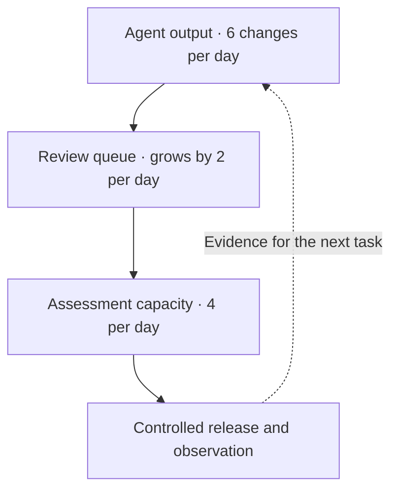

Picture a pull request with a green pipeline and a confident description. The implementation took minutes. The reviewer still has to reconstruct the failure conditions, check what the tests actually cover, and find out who will watch the release.

The agent has finished its task. It has not removed that work. It has handed it to somebody else.

Last Friday, 25 September, [Sander](https://www.linkedin.com/in/altrijssenaar/) and I took part in Xebia's Innovation Day at the tech campus in Eindhoven. It is a day set aside from client work to explore new technology. We spent ours researching GitHub's Agentic Engineering System, or AES, together.

I turned our research into a presentation, while Sander built a PowerShell-based CLI to bootstrap projects around AES. We tried the CLI together and saw promising results, including updates to shared knowledge and governance.

That shared exploration brought me back to the other end of the loop: the work that remains after an agent says it is done. That is what this article is about.

**My argument:** scale delegation only as fast as the team can review, observe, and learn from the resulting changes. More agent capacity is useful only when the next handoff can absorb it.
{: .important }

My [repository-readiness post](/stop-blaming-the-model-repository-ready-ai-agents) asked whether an agent could turn a clean checkout into a tested change. This time, assume it can. The question is whether the team can turn that change into a useful, supported outcome without accumulating a queue of unanswered questions.

## A green PR can still carry unfinished work

Imagine asking an agent to retry a timed-out customer export job. The agent adds a retry, tests a timeout followed by success, and opens a pull request. CI passes. A developer reviews and merges it.

In production, a job can finish the export and send its email notification before the worker loses the completion acknowledgement. Retrying the whole job sends another notification. Support hears about the duplicate emails while the team's job-success dashboard stays green. Someone fixes the retry behavior, but the side-effect constraint stays buried in the incident chat.

There are three unfinished handoffs here. The reviewer received code without evidence about partially completed jobs. The release reached customers without someone looking at duplicate notifications. The repair restored behavior without making the missed constraint available to the next change.

I think of that as **handoff debt**: investigation or verification left for the next person without the evidence they need. Unlike a visible failing test, it can travel through a green pipeline.

> A faster first draft is useful. A faster transfer of unfinished work is not the same improvement.

## Where AES fits

[GitHub's Agentic Engineering System](https://github.com/resources/insights/agentic-engineering-system) gives us language for examining the whole workflow. It is a tool-agnostic framework, not a product or a requirement to build a fleet of agents.

The distinction I care about most is simple: **delivering a change and discovering whether it worked are different activities.** Both need time, information, and an owner.

<details class="post__details" markdown="1">
<summary>AES in one minute: stocks, activities, and modes</summary>

<div class="table-container" role="region" aria-label="The three dimensions of GitHub AES" tabindex="0" markdown="1">

| Dimension | Elements | Practical question |
|---|---|---|
| **Stocks** | Governance, shared knowledge, customer value | What does the system build up or allow to deteriorate over time? |
| **Activities** | Define, deliver, detect | What work is happening? |
| **Modes** | Director, performer, assessor | How is a person or agent participating? |

</div>

*Stocks* accumulate or deteriorate. Documenting a job's side effects strengthens shared knowledge; stale assumptions weaken it. Customer value is the outcome these investments support, not another name for merged PRs.

*Activities* repeat: define what should happen, deliver a change, detect what happened. An incident can start the loop at detection.

*Modes* describe participation, not job titles. A director sets intent, a performer acts, and an assessor evaluates. Humans or agents can take any mode where governance permits. You do not need three agents or a new organization chart.

</details>

Applied to the export job, AES points at three handoffs. Each gets one practical check:

<div class="table-container" role="region" aria-label="Three handoff checks mapped to AES" tabindex="0" markdown="1">

| Check | Where it sits in AES | What it prevents |
|---|---|---|
| **Evidence packet** | Define → Deliver, backed by shared knowledge | Reviewers reconstructing intent from the diff |
| **Stopping point** | Governance | Instructions standing in for access controls |
| **Release receipt** | Detect, feeding back into Define | A merge mistaken for an outcome |

</div>

## 1. Give the reviewer an evidence packet, not a puzzle

*AES lens: the handoff from Define to Deliver, and the shared knowledge behind it.*

For the export job, define the intended outcome and the side effects before implementation starts. Something like this:

```text
Outcome: recover timed-out exports without duplicate customer notifications.
Evidence: job lifecycle, notification behavior, existing deduplication design.
Validation: timeouts before and after side effects; bounded retry behavior.
Out of scope: notification policy changes, live customer emails, deployment.
Escalate: if safe retries need storage or provider changes outside this task.
```

An agent can trace the job lifecycle and draft this description. A human needs to assess whether the requirement reflects the actual need. An agent-generated plan is not business intent by default.

GitHub's [implementation guide](https://learn.github.com/well-architected/governance/recommendations/agentic-engineering-system-on-github) recommends structured handoffs with linked evidence. For this task, the PR should carry:

- Links to the job's side-effect contract and retry design.
- Results of failure-path tests, including the timing cases they do not cover.
- A short explanation of the behavior change and remaining uncertainty.
- The signal to watch after release and the proposed recovery path.

This is not a demand for longer PR descriptions. Repeating “all tests pass” five times does not add evidence. Link to the actual run and say what it proves—and what it does not.

**Try this at the next review:** record the questions that require the reviewer to leave the PR and reconstruct missing context. Repeated questions are candidates for better task inputs or automated checks, not permanent reviewer chores.
{: .tip }

This is where [spec-driven development](/from-vibe-coding-to-spec-driven-development) and [repository instructions](/building-a-complete-agent-fleet) help, as long as the information stays current. GitHub's [shared-knowledge guide](https://learn.github.com/well-architected/governance/recommendations/agentic-shared-knowledge) identifies both stale context and excessive context as problems. Here, the useful addition is an accurate account of what the job does before acknowledging completion, not the entire wiki.

## 2. Give delegation an enforced stopping point

*AES lens: governance, the stock that decides what an agent is allowed to do.*

For this task, let the agent prepare a branch, run validation with a fake notification sender, and open a PR. Keep independent human approval, and keep production deployment outside its permissions.

The reason is not “agents must never deploy.” It is that retrying a side effect requires judgment, and this coding task needs neither production access nor a working customer-email credential. Delegation should match the evidence and controls we have today.

GitHub's [governance taxonomy](https://learn.github.com/well-architected/governance/recommendations/agentic-governance-taxonomy) distinguishes the standards and permissions that constrain actions from the information an agent reads. In practice:


<div class="table-container" role="region" aria-label="Guidance compared with enforceable agent controls" tabindex="0" markdown="1">

| Guidance | Enforceable counterpart |
|---|---|
| Do not merge without independent approval | Required checks and independent approval enforced by merge rules; the agent's identity cannot bypass them |
| Do not change production | No production write credentials or production-write tools available to the coding agent |
| Do not send duplicate notifications | Required failure-path tests covering retries before and after notification side effects |
| Treat workflow changes as sensitive | Protected configuration and enforced review requirements for those paths |

</div>

**An instruction is not an access control.** Review before merge cannot undo an external action an agent already performed through a tool. Restrict credentials and tools before execution, then verify that the restrictions work.
{: .warning }

Required approval still does not guarantee careful scrutiny, and tests only exercise the failures you encoded. The stopping point preserves an opportunity for judgment; it does not replace it.

## 3. Ask for a release receipt

*AES lens: Detect, and the path back into the next Define.*

The retry is deployed. Job completion improves. Are we done?

Not if customers receive the same export email twice. We need to correlate notification attempts with export identifiers, not just count successful jobs. The evidence must come from where the failure would be visible.

Attach a short *release receipt* to the issue: what we expected, what we observed, what remains unknown, and what needs to change.

```text
Expected: timed-out exports recover without duplicate notifications.
Observed: [completion rate, notifications per export, support signals]
Window and owner: [when we checked, who assessed the evidence]
Unknown: [failure paths or notification outcomes we could not observe]
Decision: [continue rollout, hold, or recover]
Follow-up: [test, documentation or control change; owner and issue]
```

Keep this proportional. A typo fix does not need an incident report. A change that can send customer emails needs more than a deployment timestamp. Define the observation window and owner before release, rather than hoping someone checks later.

An agent can collect and summarize the evidence. The assessor still has to question whether the signal is meaningful and the coverage sufficient. Missing telemetry means “unknown,” not “healthy.”

### When the receipt exposes a mistake

If customers receive duplicate emails, contain the issue first. Afterward, GitHub's implementation guide recommends three linked outputs:

1. **The fix:** restore the intended behavior.
2. **Regression tests:** reproduce the defect and pin the corrected behavior.
3. **Relevant knowledge changes:** update instructions, skills, or agent configuration where they can help prevent the same class of mistake.

For our example, add the missing “notification sent, acknowledgement lost” test and document the job's side effects. If the test command was hard to discover, repair that instruction too. Do not append an incident transcript to every agent's context.

My test of that repair is practical: **could the next similar task find the constraint without asking the person who handled this incident?** If not, the team may have fixed the code while leaving the handoff unchanged.

---

## Agent capacity is not team capacity

Even perfect handoffs can exceed what a team absorbs. Suppose agents produce six review-ready changes a day while reviewers can properly assess four. With no other change, the queue grows by two a day:



Capacity overload and handoff debt are different problems. Well-prepared work can still queue. Missing evidence adds downstream investigation and makes the queue worse. More agent sessions fix neither.

Watch the age of work waiting for review, how much context reviewers must reconstruct, and how many releases still lack an assessment of their outcome.

Before adding execution capacity, try smaller changes, better evidence packets, and a limit on concurrent delegated work. There is no universal correct limit; choose one the team can absorb and adjust it from observation. Do not resolve overload by asking reviewers to approve more casually.

That is also the right way to read AES's stock-adoption matrix: as a check on whether delegation is supported, not a ladder everyone must climb.

<details class="post__details" markdown="1">
<summary>Where this maps to GitHub's four adoption states</summary>

<div class="table-container" role="region" aria-label="GitHub AES stock-adoption matrix" tabindex="0" markdown="1">

| State | What it means | Next move |
|---|---|---|
| **Underdeveloped foundations** | Weak governance and knowledge; limited agent use | Repair the gaps before expanding |
| **Healthy but underused** | Strong foundations; limited delegation | Try additional bounded tasks |
| **Stretched agent-native system** | Agent use has outgrown its supporting foundations | Narrow scope and repair the gaps |
| **Healthy agent-native system** | Delegation is supported by strong foundations | Maintain foundations; expand where justified |

</div>

Apply this per workflow. A team can be ready for delegated documentation maintenance and unready for delegated payment changes. GitHub supplies no universal threshold for “healthy enough.”

</details>

## Don't turn it into a maturity score

Resist the “AES maturity: 82%” badge. A combined score can hide the one missing permission boundary or failure-path test that makes a particular task unsuitable for delegation.

DORA's March 2026 [analysis of AI adoption tensions](https://dora.dev/insights/balancing-ai-tensions/) gives a reason to look beyond output counts. Its analysis of 1,110 open-ended responses from Google engineers describes verification overhead and effort shifting toward review. That is qualitative, single-company evidence—not a controlled evaluation of AES or proof of my proposed handoff checks.

AES itself is useful for asking questions. It does not supply safe-autonomy thresholds or prove a return on investment. The 376% ROI figure linked from the AES page comes from a [GitHub-commissioned Forrester study](https://tei.forrester.com/go/GitHub/EnterpriseCloud/?lang=en-us) of Enterprise Cloud, not from AES adoption.

And if this sounds like good DevOps: much of it is. I would rather use AES to repair one recurring handoff than rename a working process to make it sound more agentic.

## Try it on the next change

Pick one bounded task. Keep the model and tools the same so you are not changing everything at once. Agree on these three checks before execution:

<div class="table-container" role="region" aria-label="Three practical checks for agent handoffs" tabindex="0" markdown="1">

| At the handoff | Ask for |
|---|---|
| **Before review** | An evidence packet: intent, validation results, known gaps |
| **Before agent execution** | An enforced stopping point: allowed actions and escalation conditions |
| **After release** | A release receipt: observed outcome, uncertainty, next repair and owner |

</div>

Compare it with similar work against a recorded baseline: delivery time, review effort, rework, escaped defects, and total cost including the extra preparation. Check the intended customer outcome too. One task can expose friction; it cannot prove a general productivity gain.

The [agent KPI post](/ai-coding-agents-need-kpis) covers broader measurement. Here the decision is narrower: did the added evidence reduce downstream investigation enough to justify its cost? If not, simplify it. This should remove toil, not create a paperwork queue.

**Start here:** open your most recent agent-authored PR. Find one unanswered question the next person had to reconstruct. Fix that handoff before launching another batch of tasks.
{: .tip }

We explored AES together through research, a presentation, and a CLI. My next question is what happens after delivery: how do we close the gap between “the agent finished” and “we know the change worked”?

---

## Sources and further reading

Sources reviewed on 29 September 2026. AES terminology and the adoption states come from GitHub; the linked implementation guide informs the handoff and learning practices. Handoff debt, the three-check framing, the diagram, and the fictional export-job and queue examples are my editorial application—not GitHub requirements or reported customer results.

- [GitHub's Agentic Engineering System](https://github.com/resources/insights/agentic-engineering-system), including the adoption and readiness FAQs
- [Building an agentic engineering system on GitHub](https://learn.github.com/well-architected/governance/recommendations/agentic-engineering-system-on-github)
- [Agentic governance taxonomy](https://learn.github.com/well-architected/governance/recommendations/agentic-governance-taxonomy)
- [Shared knowledge for agentic engineering](https://learn.github.com/well-architected/governance/recommendations/agentic-shared-knowledge)
- [Engineering system metrics](https://learn.github.com/well-architected/productivity/recommendations/engineering-system-metrics)
- [DORA: Balancing AI tensions](https://dora.dev/insights/balancing-ai-tensions/)
- [Anthropic: Effective context engineering for AI agents](https://www.anthropic.com/engineering/effective-context-engineering-for-ai-agents)
- [Forrester: The Total Economic Impact of GitHub Enterprise Cloud](https://tei.forrester.com/go/GitHub/EnterpriseCloud/?lang=en-us)